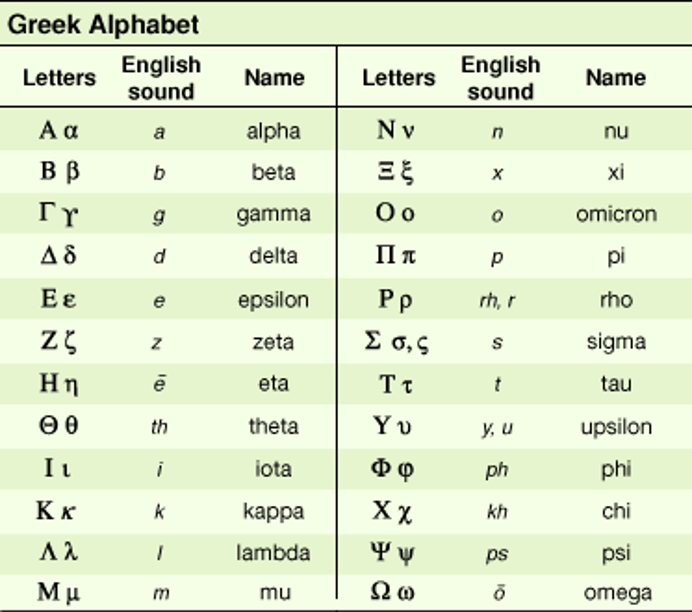
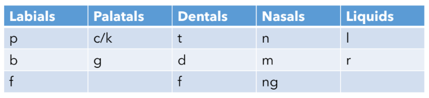

# Lesson 2: How Latin and Greek Work
{: .no_toc}

1. TOC
{:toc}

## Objectives

1. Introduce the Latin and Greek alphabets
2. Discuss transliteration from Greek to Latin and English
3. Overview of common language patterns in word formation

## The Greek Alphabet

*The Greek and English alphabets. Image credit: Britannica*

For this class, you are not going to be tested on your ability to memorize the Greek alphabet. In any situation where you might have to read Greek terms in the original language, you will have the alphabet provided as a reference. Depending on your background, you might already be familiar with some of these letters, or the Greek language itself!

Some Greek letters have similar sounds and shapes as their English counterparts:

| Greek letter  | English letter    |
| :---          | :---              |
| Α α           | A a               |
| Β β           | B b               |
| E ε           | E e               |
| Ι ι           | I i               |
| Ζ ζ           | Z z               |
| Κ κ           | K k               |
| Μ μ           | M m               |
| N ν           | N n               |
| O o           | O o               |
| T τ           | T t               |

There are a couple that look tricky-- lowercase nu may be mistaken for a lowercase V, both uppercase and lowercase rho may look like P, uppercase upsilon may look like an uppercase Y, and lowercase omega resembles a lowercase W.

### Transliteration

Transliteration comes from the Latin roots **trans** (across) and **littera** (letter). It's the process of representing the same sounds in different languages. Since many of us don't speak or read Greek, we need a way of representing those roots in an alphabet that's more familiar to us. You can think of transliteration as a cypher or code to switch between one language and another, while still representing the same sounds.

There are a few Greek letters that have interesting patterns in English transliterations. Wherever you see a C or a CH in Greek, those were letters that were originally represented by a kappa (κ) or a chi (χ). So even though those letters make a K or a hard C sound, they will sometimes be represented in English with the letter C. This is because when we transliterate the kappa to English, we can use either a K or a C, since both letters make the same sound in English.

The rho is the letter that looks something like a P. Sometimes in physics it’s used to represent density. Here, it represents the letter R. The Greek R sound is different from the English R sound, though, because the Greek R sounds is *aspirated* (it's a bit of a rolled-R sound). When transliterating rho to English or Latin, sometimes an H is added after the R to indicate that it’s aspirated. This doesn’t happen all the time, but it is something to be on the lookout for.

You’ll notice that H is not actually part of the Greek alphabet; whenever you see an H in the bases, prefixes, or suffixes, that tells you that there’s actually an aspirated letter. That’s also why the chi is spelled as CH instead of C. It’s a similar sound, but there’s an aspect of breathiness to it.

Finally, let's look at upsilon (υ). This is a funny letter, since it's sometimes transliterated as a Y, as in **hydro** (water) and **hyper** (above, over), but sometimes it's transliterated as a U, as in **neuro** (nerve) Why is that, when they’re the same letter in Greek?

The answer has to do with part of the reason I’m not asking you to memorize or write out letters in the Greek alphabet. Before English became the common language of communication and science, it was Latin. More world languages use the Latin alphabet than the Greek alphabet, so it was easier to read these terms when they were transliterated. There’s an added quirk that many of the Greek words that we use today actually passed through Latin before arriving into English. So some of the spelling quirks are remnants of Latin as well.

## The Latin Alphabet

The Latin alphabet is virtually the same as English, with the following exceptions:

- There is no W
- There is no K (technically, there is, but it's rarely used)
- U and V are the same letter
- I and J are the same letter

Many Greek medical and mathematical terms bypassed Latin before coming into English, simply due to historical context. In the ancient Mediterranean, Latin was in wide use because of the spread and influence of the Roman empire. However, Greek tended to be used as the language of science because these studies originated in ancient Greece. Rather than inventing new words for the same concepts, Latin transliterated the Greek terms.

Let's use the Greek word σφαιρα ("sphaira", pronounced “spy-ra”) as an example. The point of transliteration is to represent one alphabet with another, while retaining a pronunciation as close to the original as possible. 

Transliterating σφαιρα letter-by-letter would give us "sphaira". However, the Latin language doesn't really use the diphthong "ai". Rather, it uses "ae". Thus, the Latin equivalent for σφαιρα would be *sphaera*.

Now it's time for σφαιρα (sphaera) to pass to English. Since English and Latin use the same alphabets, we don't need to transliterate. However, just because the languages use the same alphabet doesn't mean that the letters will be pronounced the same way. Notably,

* *ph* in English is usually pronounced as an "f" sound, rather than an aspirated "p"
* *ae* in English is often pronounced the same as a short or long "e"

Over time, both a's drop out, giving us *sphere* instead. In English, this word is pronounced like "sfeer", rather than like "spear".

{: .note}
> A diphthong is a group of two or more vowels that make one vowel sound. In this example, the diphthongs *ai* and *ae* both make the long *i* sound (like the word "eye")

## Contraction and Assimilation

Contraction and assimilation are two phenomena that occur in Latin and Greek that explain how and why some spelling patterns occur. Contraction exists in both languages, while assimilation is more exclusive to Latin preposition roots (at least, in this class). Many other world languages experience some degree of these phenomena, including English! 

### Contraction

Contraction happens when one or more letters are omitted from the pronunciation of a word or phrase. In written English, we often see this with the word "not" or a form of "to be" ("is", "are", "were", etc.) Here are some examples:

- I + am = I'm
- She + is = She's
- Can + not = Can't
- Will + not = Won't

Some accents and dialects of English may also use contraction in the way words are pronounced, rather than how they're written:

- In African-American Vernacular English and Southern American English, the "day" in days of the week may be pronounced closer to "dee" than "day". For example, "Sundee" instead of "Sunday", even though there is no change to the spelling of the word
- Some New England accents drop the second *t* in "twenty", pronouncing the word closer to "twenny"

Most of the contraction that you'll see in Latin and Greek belongs to the former category, where letters are dropped between words. Most often, the last letter of the first root will be dropped. Remember that each root can be considered its own word, so the following rules apply when two roots meet:

1. Any root that ends in a vowel + any root that begins with a vowel or h
2. Greek "a/an"
3. Latin "a/ab" and "e/ex"

#### Roots with vowels

{: .note }
> The vowels are *a*, *e*, *i*, *o*, and *u*. The consonants are all other letters.

Many roots in both Greek and Latin will follow this rule. For example, let's look at the Greek root **dia** (meaning "through" or "across") and how it interacts with other roots:

* dia + opt in *diopter* (a unit of measurement in refractive lenses)
    * Note that the *a* drops out here, since *opt* begins with a vowel
* dia + meter in *diameter* (the maximum linear distance between two points on a circle)
    * Here, no letters are dropped since *m* is not a vowel

#### Greek "a/an"

The Greek root *a* is often found as a prefix to mean "not". However, it has two forms, depending on whether the following root begins with a consonant or vowel. The meaning of the root itself doesn't change. It's similar to the articles *a* and *an* in English,; we'd say "an apple" but "a banana".

* *adynamia* comes from *a* + *dynam* (power). Adynamia is the lack of strength or movement, usually as a symptom of another disease.
* *anesthetic* comes from *a* + *(a)esth* (to feel, to perceive). Anesthetics are drugs designed to induce full or partial numbness in the body.

#### Latin "a/ab" and "e/ex"

Both of these Latin roots are similar, having one form before roots that start with consonants and another before roots that start with vowels. Be careful not to confuse the Latin *a* with the Greek *a*! You can usually use context clues to determine which one is which. The Latin *a* tends to attach to Latin verbs, while the Greek *a* tends to attach to Greek roots, regardless of their part of speech.

- a + vert in *avert* and *aversion* use "a" rather than "ab", since *vert* starts with a consonant
- ab + err in *aberrant* uses "ab", since *err* starts with a consonant

However, there's not really a strong pattern to when to use "ex" vs "e" as a prefix. You will never see "e" in front of a root that begins with a vowel, but you may see "ex" in front of roots that begin with consonants.

- e + dent in *edentate* since *dent* starts with a consonant
- ex + orbit in *exorbital* since *orbit* starts with a vowel
- ex + tend in *extend*, even though *x* and *t* are both consonants

### Assimilation

**Assimilation** is a phenomenon almost exclusive to Latin prepositional roots. It's similar to contraction in the expected spelling of a root may change when it combines with another root. However, instead of dropping a letter, assimilation *changes* what the letter is. More specifically, assimilation changes the last consonant of the prepositional root to match the first consonant of the root that follows.

Roots that undergo assimilation are marked with an asterisk (*) in the vocabulary. They will almost always be found as prefixes when they are assimilated. Here are some examples:

* con + loc in *collocate*
* ad + tend in *attend*
* sub + port in *support*

However, each of these also has instances where they *don't* assimilate:

* con + vert in *convert*
* ad + vis in *advise*
* sub + mar in *submarine*

When do you know whether a preposition assimilates or not? We'll need to do a brief linguistic detour to figure out how and why this happens.

These categories– labials, palatals, dentals, nasals and liquids–- are named for the part of your mouth that the sounds originate from. *Labial* is from the Latin root **labi**, which means "lips". When you make these letter sounds and you think about where the sounds originate, you'll notice that they begin near the front of your mouth at your lips. 

*Palatals* are **c**, **k** and **g**. All of these sounds will start at the roof of your mouth, which is called the *palate.* 

The root of *dental* is **dent**, which means that they start at your teeth. These are the consonants **t**, **d**, and **f**. F is a bit of a special case because it does begin at your teeth, but your lips are also involved. The proper linguistic term is that f is a *labio-dental*, because it involves both the lips and the teeth, but that distinction isn’t actually super important here. As such, you can see it in both the categories for labials and dentals.

The *nasals* technically begin in your mouth, but they’re called “nasals” because they also involve the nose. These are the the consonants **n** and **m**, and the combination **ng**.

Finally, there are *liquids*, which are not named for a part of the mouth but for their more fluid nature, the way they sound. This is **l** and **r**.

{: .note }
> Not all the English consonants are represented in this table. For example, the letters s and v are not in this table. This table only shows the consonants that tend to undergo assimilation.

Assimilation happens when the final consonant of a preposition is in the same family as the first consonant of the following root. To determine whether a preposition assimilates, we check the last consonant of a prefix and see whether it's the same as the first consonant of the following root. The converse of that is that if the final consonant of the preposition does not have the same family as the first consonant of the following root, then the preposition doesn't assimilate. 

There are a couple of extra rules:

1. Liquids will assimilate any preposition except *sub*
2. Dentals can assimilate to *s*

Let's break down some of the earlier examples. 

- In the word *collocate*, we see that the *n* in **con** is a nasal. The *l* in **loc** is a liquid. Though they're not in the same family, we know from Rule 1 that liquids can assimilate any preposition. Thus, the *n* in **con** turns into another *l*.
- In the word *convert*, we see that the *n* in **con** is a nasal. However, the *v* of **vert** is not listed in the table. It doesn't ever assimilate any prepositions. Thus, **con** is left as it is.

You are not responsible for memorizing this consonant chart to say which families are where. You can always come back and refer to this if you're stuck on whether a prefix is assimilated or not. This is just another way to figure out why these prefixes are assimilated and why they look the way they do.

## Vocabulary list

| Root          | Language of origin    | Meaning                   | Example           |
| :---:         | :---:                 | :---                      | :---              |
| hypn(o)       | Greek                 | sleep                     | hypnosis          |
| cine/kine     | Greek                 | movement                  | kinetic           |
| dynam         | Greek                 | power                     | dynamic           |
| erg           | Greek                 | energy                    | ergonomic         |
| the           | Greek                 | to put, to place          | thesis            |
| chron         | Greek                 | time                      | chronology        |
| meter/metry   | Greek                 | measurement               | geometry          |
| path(o)       | Greek                 | feeling, disease          | pathology         |
| hydr(o)       | Greek                 | water                     | hydrant           |
| neur(o)       | Greek                 | nerve                     | neurosis          |
| top(o)        | Greek                 | place, location           | topology          |
| spher(e)      | Greek                 | sphere, globe             | hemisphere        |
| trop          | Greek                 | to turn                   | thermotropism     |
| cata          | Greek                 | against, very, down       | catastrophe       |
| dia           | Greek                 | through, across           | diagonal          |
| tele          | Greek                 | far, from afar            | telepathy         |
| phon          | Greek                 | sound, voice, speech      | phonics           |
| meta          | Greek                 | with, beyond, after       | metastasize       |
| syn           | Greek                 | together, with            | synthesize        |
| a/an          | Greek                 | not, without              | asexual           |
| anti          | Greek                 | against, opposed to       | antitoxin         |
| somn(i)       | Latin                 | sleep                     | insomnia          |
| scrib/script  | Latin                 | to write, written         | prescribe         |
| sens/sent     | Latin                 | to feel, to perceive      | sentient          |
| corp          | Latin                 | body                      | corporeal         |
| spir          | Latin                 | breath, to breathe        | respirator        |
| spect         | Latin                 | to look                   | inspect           |
| labi(a)       | Latin                 | lips                      | labial            |
| dent          | Latin                 | tooth                     | dentist           |
| loc           | Latin                 | place                     | location          |
| mar           | Latin                 | ocean                     | marine            |
| cal(or)       | Latin                 | heat                      | calorie           |
| fac(t)/fec(t) | Latin                 | to make                   | factory           |
| tend(e/o)     | Latin                 | to stretch                | extend            |
| vert/vers     | Latin                 | to turn                   | invert            |
| a/ab          | Latin                 | down from, away from      | abduct            |
| e/ex          | Latin                 | out of, outside, former   | expel             |
| inter         | Latin                 | between                   | international     |
| intra         | Latin                 | within                    | intramural        |
| de            | Latin                 | down from, out of         | deduce            |
| circu(m)      | Latin                 | around                    | circumscribe      |
| ad*           | Latin                 | to, towards               | advance           |
| sub*          | Latin                 | beneath, below, under     | substitute        |
| con/com*      | Latin                 | with                      | concur            |
| in*           | Latin                 | into, inside, on          | include           |
| in*           | Latin                 | not, without              | include           |
| ob*           | Latin                 | against, facing           | obtuse            |

## Vocabulary practice

**Practice Set A.** Use the Greek-English alphabet provided to transliterate each of the following Greek words to English. Then, using your knowledge of the roots, tell what each word means.

1. υπνος
2. παθος
3. υπερ
4. γραφη
5. πολυ
6. λογος
7. κατα
8. φωνη
9. συν
10. υδρος

**Practice Set B.** Identify the roots in each of the following words, give their language of origin, and their definitions. Some words will have more than one root from the lesson's vocabulary!

1. circumference
2. subscription
3. synesthesia
4. teleport
5. calorifacient
6. interfere
7. energy
8. offer
9. topography
10. inscribe
11. neuropathology
12. metamorphosis
13. incorporeal
14. sensation
15. cinematic

**Practice Set C.** Tell whether the following preposition and root combinations will experience assimilation or not. (Hint: Recall that assimilation is exclusive to Latin prepositions, and refer to the rules in [Assimilation](#assimilation))

1. con + fect
2. ad + scrib
3. ob + port
4. sub + aqua
5. hyper + therm
6. super + dynam
7. in + fer
8. de + cal
9. a + hydro
10. in + somni

## Reflection Questions

1. What was your experience with the Greek alphabet like before this lesson? In what contexts have you seen Greek letters or words in the original alphabet?
2. What language(s) are you familiar with? Do those languages experience any contraction or assimilation? Give examples.
3. Choose any three preposition roots from this lesson and give three examples each, of words you know that don't appear in this lesson but use those roots. (A total of 9 words, with their definitions)
4. Choose any three Greek roots from the vocabulary you know so far and try transliterating them back to Greek (don't use words that were used in Practice Set A!).
