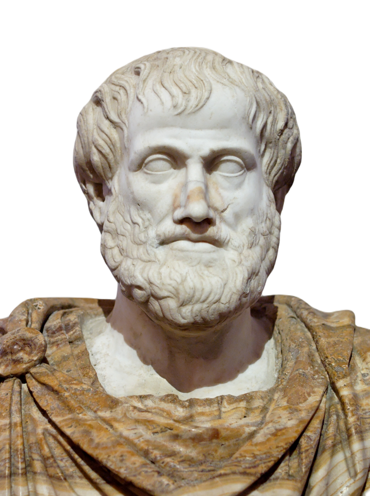

# Lesson 4: Taxonomy
{: .no_toc}

1. TOC
{:toc}

## Objectives

1. Learn about the history of taxonomy and its uses in biological classification
2. Discover the role of Greek and Latin terms in rank-based taxonomy

## Introduction to Taxonomy

***Taxonomy*** comes from the Greek words *taxis* (ordering, arrangement) and *nomia* (law, method, practice). Simply put, a taxonomy is a method of ordering or arranging a collection of items. You may have heard of Bloom's taxonomy, which is a system for categorizing educational goals. Maslow's hierarchy of needs categorizes human needs at a physical and psychological level. The taxonomy of programming languages sorts different programming languages according to syntax, function, or use (though you'd be hard-pressed to find one universal taxonomy).

In biology, however, *taxonomy* takes on a specific meaning. Taxonomy refers to the specific method of classifying and naming living organisms. The modern taxonomical system uses a **rank-order system**, which organizes living organisms in a hierarchical structure. Each level of the hierarchy is called a **rank**.

*The rank-order system. (Image credit: Encyclopedia Britannica)*

The **rank-order system** of taxonomy organizes living organisms into a hierarchical structure, facilitating a clear understanding of their relationships and classifications. This system consists of several ranks, each representing a different level of biological classification. The primary ranks include domain, kingdom, phylum, class, order, family, genus, and species. Each rank groups organisms based on shared characteristics, with higher ranks encompassing broader categories and lower ranks being more specific. 

Let's look at the classification of the gray wolf (canis lupus):

- Domain (Eukarya), 
- Kingdom (Animalia), 
- Phylum (Chordata), 
- Class (Mammalia), 
- Order (Carnivora), 
- Family (Canidae), 
- Genus (Canis),  
- Species (Canis lupus).

*A gray wolf. Image credit: Encyclopedia Britannica*

At the top of this hierarchy is the **domain**, which represents the broadest category. Within each domain, organisms are further divided into **kingdoms** based on more specific shared traits. For example, the kingdom *Animalia* includes all animals, while the kingdom *Plantae* encompasses plants. The next level, the **phylum**, describes a specific physical characteristic shared among all members of that phylum. For example, *Chordata* (which comes from the Greek word for "rope" or "sinew") includes all animals that have some structure supporting their backs, such as a backbone.

As you move down the ranks, each level becomes increasingly specific, allowing for a hierarchical classification of organisms that share similar traits. This structured approach enables scientists to identify and study organisms systematically, fostering a better understanding of their evolutionary relationships.

{: .note}
> In fact, the word *specific* originally was used to mean "having the same appearance or characteristics"

Each rank also serves as a way to communicate important biological information. For example, the **family** rank groups organisms that share more specific characteristics, such as behavioral traits or genetic similarities. In the case of the gray wolf, being part of the *Canidae* family indicates its close relationship with other canids, like domestic dogs and foxes. The **genus** rank further narrows down the classification, indicating a close-knit group of species that share a recent common ancestor. Finally, the **species** rank identifies individual organisms that can interbreed and produce fertile offspring, forming the fundamental unit of biological classification.

## Latin and Greek in Scientific Naming

Greek and Latin play a crucial role in taxonomy and in the naming of species. This dual-language foundation stems from the historical influence of Greek philosophers and Roman scholars in early scientific discourse. Latin, as the language of scholarship and science during the Renaissance, became the primary medium for formalizing species names. In our gray wolf example, the genus *canis* comes from the Latin word for "dog", and the species *lupus* is the Latin word for "wolf".

Greek, on the other hand, contributes to many of the root words used to describe characteristics of organisms. For example, the megalodon, a prehistoric species of shark, takes its name from the Greek words *megalos* (large) and *odon* (tooth).

{: .note}
> The full scientific name of the megalodon is the *Otodus megalodon*. "Otodus" comes from the Greek words *otos* (ear) and *odon* (tooth), since other prehistoric sharks in this genus have teeth that resemble pointed ears. Sometimes, the same root will appear more than once in one scientific name.

## The History of Taxonomy

### The Aristotelian System

    

        
        <figcaption style="text-align: left; margin-top: 5px;"><i>A bust of Aristotle. Image credit: Wikipedia</i></figcaption>
    

    
Though the practice of naming, classifying, and identifying plant and animal species was vital to the development of early civilizations (as it was important to know which plants were edible, medicinal, and poisonous), the first widely-used system of classification in the West came from the Greek philosopher <b>Aristotle</b>. 

    
 

In the 4th century BCE, Aristotle introduced a hierarchical classification system based on shared characteristics among living beings. He divided organisms into two main categories: plants and animals, further subdividing them based on observable traits such as habitat and physical attributes.

However, Aristotle's system had its flaws. Since microscopes would not be invented until nearly two millennia later, Aristotle's system does not include microscopic organisms, such as plankton, amoeba, bacteria, or protists. Further, his method of rationalizing about plants and animals was quite different from how modern biologists might use DNA sequencing or empirical research to determine how species are related to one another. As such, some of Aristotle's classifications turned out to be misguided or straight-out wrong.

For example, one of the distinguishing characteristics for dividing animal categories was whether or not the animal had blood. (We know now that all animals have blood). Aristotle called "blooded" animals *Enhaima*, and "non-blooded" animals *Anhaima*. Some examples of *Enhaima* included humans, cats, dolphins, snakes, and sharks. Some examples of *Anhaima* included shrimps, squids, insects, and worms.

{: .note}
> Though Aristotle was misguided in the idea of distinguishing whether animals had blood or not, the *Enhaima* and *Anhaima* categories broadly map onto the modern biologist's *vertebrates* and *invertebrates*.

### Middle Ages

With the fall of the Roman Empire, much of the dissemination of knowledge and science from the Ancient Greek world also fell away. During the Middle Ages in Europe, the study of taxonomy came to a standstill as classical texts were largely ignored in favor of religious ones. This period also saw the compilation of herbals, which were essential texts that categorized plants based on their uses rather than strictly their biological characteristics. However, Islamic scholars from the 8th and 9th centuries onward preserved many classical texts, including Aristotle's philosophies and developed more sophisticated classifications that included additional criteria. Many of these scholars were agriculturists, botanists, and zoologists both interested in theoretical research, the practicalities of raising crops and livestock, and how to treat illnesses.

One such scholar was **Abū Ḥanīfa Aḥmad ibn Dāwūd Dīnawarī (Al-Dinawari)** in the mid-9th century, who worked in the early Greek tradition set forth by Aristotle. Whereas Aristotle and many later European scholars believed in a fixed number of species on Earth, Al-Dinawari's work documents how plants can evolve and diversify over time. Al-Dinawari's most famous work was his *Book of Plants*, for which he is also called the founder of Arabic botany.

Around the same time, **Abu Uthman Amr ibn Bahr al-Kinani al-Basri (al-Jahiz)** wrote his *Book of Animals*. There is debate as to how much his work was influenced by Aristotle, but the book itself shares some philosophical and organizational principles. al-Jahiz also took note of animals' habitats and behaviors in addition to their physical characteristics. He also posed a theory called the "struggle for existence", which claims that animasl compete with each other for natural resources like food and shelter. Those that survive go on to produce offspring that inherit their traits. al-Jahiz's theory of the "struggle for existence" can in some ways be seen as a precursor to Darwin's "survival of the fittest".

### Renaissance

The Renaissance marked a renewed interest in nature and science, leading to significant advancements in taxonomy. The invention of the printing press allowed for the widespread distribution of scientific texts, facilitating the sharing of knowledge among scholars.

    

        
English naturalist and botanist John Ray was heavily influenced by the Aristotelian system of taxonomy but gradually grew to reject it. Ray worked primarily with plants, and he established the definition of a <i>species</i>, which essentially were organisms that derived from like organisms. In other words, plants that came from the same seeds were of the same species.

    

    

        
        <figcaption style="text-align: left; margin-top: 5px;"><i>John Ray. Image credit: Wikipedia</i></figcaption>
    

    

        
        <figcaption style="text-align: left; margin-top: 5px;"><i>The French naturalist Joseph Pitton de Tournefort. Image credit: Wikipedia</i></figcaption>
    

    
The work of French naturalist and botanist <b>Joseph Pitton de Tournefort</b> in the late 17th century also played a pivotal role in taxonomy. Tournefort is best known for his classification of plants, which he organized based on their floral structures. His system focused on the physical characteristics of plants, rather than a strict hierarchical system. Tournefort's influence was significant, as he established the concept of a <i>genus</i>, which later taxonomies adopted and expanded upon. His classifications emphasized the importance of morphology in understanding plant relationships, paving the way for more systematic botanical studies.

    
 

## The Linnaen System

    

        
        <figcaption style="text-align: left; margin-top: 5px;"><i>Portrait of Carl Linnaeus by Alexander Roslin. Image credit: Wikipedia</i></figcaption>
    

    
Much of the contemporary taxonomic system owes greatly to Carl Linnaeus, an 18th-century Swedish naturalist and botanist. Linnaeus introduced a binomial nomenclature system in the 18th century, which revolutionized taxonomy by providing a standardized method for naming species. Each organism was assigned a two-part Latin name, consisting of the genus and species. This system not only brought clarity and consistency to naming practices but also facilitated communication among scientists worldwide. Linnaeus’s works, particularly *Systema Naturae*, systematically classified thousands of species, providing a framework that is still in use today.

    
 

Linnaeus emphasized observable characteristics, grouping organisms based on physical traits such as flower structure in plants and anatomical features in animals. In particular, he did away with the floral structure of Tournefort's system, since he recognized that not all plants produce flowers. Instead, Linnaeus categorized his plants based on their reproductive characteristics (a decision that earned him a controversial reputation among his contemporaries). Linnaeus found that some plants were sexually dimorphous, with some flowers producing either stamens (male parts) or pistils (female parts). Linnaeus classified plants according to the number of stamens and pistils their flowers produced, or whether a flower could have both stamens and pistils. (Linnaeus called such plants *monoecious*, from the Greek words "mono" (one) and "(o)ekos" (dwelling).) After experiments and observations with the male and female plants, Linnaeus confirmed Ray's theory that only plants of the same species could produce offspring.

This empirical approach allowed for a clearer understanding of the relationships among species and laid the groundwork for further advancements in biological classification. While he used the rank-order system in almost the same way that biologists use it today, he also created a shorthand for cataloguing different species. Previously, organisms' names consisted of long, cumbersome Latin names (even longer than some of them are today) and phrases that gave extremely detailed descriptions of the organism but were difficult to memorize and write quickly. Instead, Linnaeus and his students shortened these names to one genus and one species&mdash; the binomial system that is in use today.

Linnaeus was a popular and celebrated figure in his own time, and he amassed several students which he called his "apostles". Among these were Peter Kalm, Pehr Löfling, Daniel Rolander, Daniel Solander, and Carl Peter Thunberg. Linnaeus instructed these apostles to go out on expeditions into different parts of the world to record and send samples of the species they encountered there. Unfortunately, many died on the expeditions, and Linnaeus took to naming other organisms in their honor (Kalmia, Loeflingia, Rolandra, Solandra, and Thunbergia, respectively). Though some of Linnaeus's names have been changed in the modern day, many of them carry the *L.* prefix in front of them to honor the system they originally came from.

{: .note}
> Linnaeus was fond of naming organisms after mythological figures or people he knew. One of Linnaeus's close friends from university was Peter Artedi, the "father of ichthyology". While in school, the two friends had discovered a common interest in the natural world and classifications. They vowed to embark on a shared quest to name and classify all the world's species. However, Artedi's untimely death at the age of 30 meant that Linnaeus had to continue most of the work alone. Later, he would name a flower for his friend, the *Artedia squamata*.

## Vocabulary list

| Root          | Language of origin    | Meaning                   | Example           |
| :---:         | :---:                 | :---                      | :---              |
| tax(i/o)      | Greek                 | ordering, arrangement     | taxidermy         |
| nom(y/ics)    | Greek                 | law, method, practice     | astronomy         |
| psych         | Greek                 | mind, soul                | psychology        |
| odon(t)       | Greek                 | tooth                     | orthodontics      |
| ot(o)         | Greek                 | ear                       | otodus            |
| (h)aem(o)     | Greek                 | blood                     | haemoglobin       |
| chrom(o)      | Greek                 | color                     | chromatic         |
| (o)ec         | Greek                 | home, dwelling            | economics         |
| mast(o)       | Greek                 | breast, teat              | mastectomy        |
| megal(o)      | Greek                 | large, big                | megalodon         |
| aut(o)        | Greek                 | oneself, one's own        | automatic         |
| heter(o)      | Greek                 | different, other          | heterosexual      |
| hom(o/eo)     | Greek                 | same, like                | homophone         |
| all(o)        | Greek                 | other                     | allele            |
| mon(o)        | Greek                 | one, single               | monochrome        |
| phil(o)       | Greek                 | to love, to like          | philosophy        |
| phag(o)       | Greek                 | to eat                    | phagocyte         |
| troph(o)      | Greek                 | to nourish, to feed       | autotroph         |
| eu            | Greek                 | good, well                | euphemism         |
| dys           | Greek                 | bad, disordered           | dyslexia          |
| form          | Latin                 | shape, form               | formation         |
| speci(e)      | Latin                 | appearance, form, quality | specific          |
| gen(e)        | Latin                 | clan, type, origin        | genetics          |
| mamm(o)       | Latin                 | breast, teat              | mammal            |
| carn(i)       | Latin                 | meat                      | carnal            |
| herb(i)       | Latin                 | plant                     | herbal            |
| equ(i/a)      | Latin                 | equal, same               | equivalent        |
| vor(a/e)      | Latin                 | to eat                    | voracious         |
| dic(t)        | Latin                 | to speak, to say          | diction           |
| contr(o/a)    | Latin                 | against, opposite         | controversy       |
| dis/di/dif    | Latin                 | apart from, separately    | divide            |
| post          | Latin                 | after                     | postscript        |

## Vocabulary practice

**Practice Set A.** Identify the roots in each of the following words, give their language of origin, and their definitions.

1. herbivore
2. dystrophy
3. heterochromia
4. mammary
5. mastodon
6. Eutaxia
7. ultraviolet
8. psychologist
9. contradict
10. alloplasty
11. sarcophagus
12. homeostasis
13. haemophilia
14. eugenics
15. psychometrics

**Practice Set B.** For each of the words in Practice Set A, arrange the definitions of the individual roots to create a literal definition. Here's an example for the word *biology:*

- bio: life (Greek)
- log(y): word, reason, study (Greek)
- Definition: study of life

## Reflection Questions

1. What do each of the words in the full rank-order classification for the gray wolf mean? You may have to look some of them up.
2. Find the full rank-order classification of your favorite organism and tell what each of the words mean. You may have to look some of them up.
3. Most taxonomical systems from ancient times to the Enlightenment based classifications solely on an organism's physical characteristics. What is one advantage of this? What is one shortcoming of this? Explain your answers.
4. Linnaeus had a penchant for giving organisms the names of people he knew. What might be one problem with this, and why? Think about the purpose of the rank-order classifications and what each rank is meant to represent.
