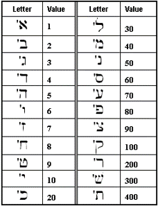
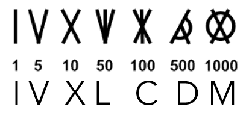
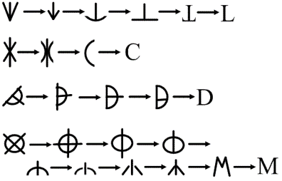

# Lesson 7: Numbers
{: .no_toc}

1. TOC
{:toc}

## Objectives

1. Become familiar with Greek and Latin number prefixes
2. Learn the basics of Roman numerals

## Number Prefixes

Number bases might already be familiar to you if you've used the metric system at any point. Typically, number bases are found at the beginnings of words, which makes them prefixes. Here is a list of common number bases in both Latin and Greek:

| Definition            | Latin form        | Greek form        |
| :---                  | :---              | :---              |
| half (1/2)            | semi              | hemi              |
| one (1)               | uni               | mono              |
| two (2)               | du(o), bi         | di                |
| three (3)             | tri               | tri               |
| four (4)              | quad/quatr        | tetr(a)           |
| five (5)              | quinqu            | pent(a)           |
| six (6)               | sex(a)            | hex(a)            |
| seven (7)             | sept(em)          | hept(a)           |
| eight (8)             | oct               | oct(a)            |
| nine (9)              | nov(em)           | enne(a)           |
| ten (10)              | dec(i)            | dec(a)            |
| one hundred (100)     | cent(i)           | hect(a)           |
| one thousand (1000)   | mill(i)           | kil(o)            |

What you saw above were **cardinal** numbers, or counting numbers. There are a few roots that come from **ordinal** numbers:

| Definition            | Latin form        | Greek form        |
| :---                  | :---              | :---              |
| first                 | prim(a)           | prot(o)           |
| second                | second/secund     | deut(er)          |
| third                 | terti/tern*       | ---               |
| fourth                | quart/quatern*    | ---               |
| fifth                 | quint/quin*       | ---               |
| sixth                 | sext              | ---               |
| seventh               | septim            | ---               |
| eighth                | octav             | ---               |
| ninth                 | non               | ---               |
| tenth                 | decim             | ---               |

For the roots marked with an asterisk (\*), the force of the roots ending in *-n* is more akin to "X times" or "the Xth time". For example, **tern** means "3 times" or "the 3rd time".

## Roman Numerals

Chances are that you have seen the Roman number system at least once before reading this chapter.The basic idea behind the Roman number system is that you have different letters that represent numeric values.

| Hindu-Arabic Numeral  | Roman Numeral |
| :---:                 | :---:         |
| 1                     | I             |
| 5                     | V             |
| 10                    | X             |
| 50                    | L             |
| 100                   | C             |
| 500                   | D             |
| 1000                  | M             |

The letter **M** is more commonly used to represent 1000. In Roman times, the symbol ↀ was used for 1000 instead of M. During medieval times, the ↀ gradually transformed into an M. This was also convenient since the word for 1000 is *milia* in Latin.

{: .note}
> There also technically exist symbols for 10,000 and 100,000; which are ↂ and ↈ, respectively. These are extremely rare in the Roman world, and practically never used in the modern day.

Similarly to how **M** came to represent 1000 from *milia*, we can also see a connection between *centum* and **C** for 100. However, that logic doesn't apply to the other numbers in this table. You don't even need to be familiar with Latin for this! You can reference the roots in the [Number Prefixes](##number-prefixes) section. Note these discrepancies:

- 1 in Latin is *unus*, but its symbol is **I**
- 5 in Latin is *quinque*, but its symbol is **V**.
- 10 in Latin is *decem*, which begins with a **D**, and yet D is used for 500. Curious...

### Number Symbols
In the modern world, it might seem a little strange that you can have letters representing numbers, because what if you have two numbers that begin with the same letter? Like in English, for example, four and five both begin with F. What would you do with that?

In the ancient Greek, Hebrew, and Phoenician alphabets, the number value that's associated with the letter usually has nothing to do with the way that the number is pronounced.

Note how in the Greek alphabet pictured above, the numbers are just assigned in the order of the alphabet. In Ancient Greek, the number one in Greek is pronounced "heis" (εἷς), "mia" (μίᾰ), or "hen" (ἕν), depending on grammatical gender. None of those begin with alpha! The takeaway is that the number one is not necessarily associated with any particular letter; it just happens to be assigned that way in the numbering system. Using an alphabetical system to represent numbers avoids the problem of having to invent new symbols for numbers&mdash; particularly for societies that didn't conceive of the number 0.

A similar idea happens in the Hebrew alphabet as well, where numerical values are systematically assigned to every letter in the alphabet. In Hebrew, the number one is ekhad (אחד) or akhat (אחת) &mdash;again depending on gender&mdash;, which both happen to begin with aleph (א), the first letter. But when we get to the number two, we have the letter bet (ב), but the word for "two" is either sh’nayim (שְׁנַיִם) or sh’tayim (שְׁתַּיִם), which both begin with the letter shin (ש).

{: .note}
> Side note: A similar thing happens with ASCII values in computer programming! Letters and symbols are systematically given numeric values that often have no connection to the symbols themselves.

### Origins of Roman Number System

One difference between the Roman number system and the Greek and Hebrew systems is not every letter in the Roman alphabet actually gets a number. Every letter in the Greek and Hebrew alphabets is assigned a numeric value, but only seven letters out of the entire Latin alphabet have numbers.

The most common theory behind this is that this system of numbering and reckoning symbols was adopted from the Etruscan number system, which looks like this:

The similarities between the Latin and Etruscan number symbols become more apparent. 1, 5, and 10 actually have the same symbols in the Latin and Etruscan alphabet; it's 50, 100, 500, and 1000 that are given different symbols. But the fact remains that we see the same number of symbols and the same numbers are being symbolized. (The Etruscans aren't assigning a symbol for 2, for example.)

Here’s another visualization that represents the evolution of how one theory of how the Etruscan numbers would have evolved into their Roman counterparts. 

Now, this is just a theory, so it might not have really happened like this, but it's one of the ways that we think these letters could have started to be used by the Romans to represent their numbers.

### Additive System

Now, just because the Roman number system was limited to seven symbols doesn't mean that the Romans didn't have a concept of numbers in between 1, 5, 10, 50, 100, and so on.

What they did instead was they used something called the additive system to represent these other numbers. The basic principle behind the additive system is that we use the fewest letters possible that add up to the number we want to represent. These letters are then arranged from greatest to least. To interpret the numeral, the value of each symbol is added together.

Here are some examples:

- 33 = 10 + 10 + 10 + 1 + 1 + 1 = **XXXIII**
- 156 = 100 + 50 + 5 + 1 = **CLVI**
- 844 = 500 + 100 + 100 + 100 + 10 + 10 + 10 + 10 + 1 + 1 + 1 + 1 = **DCCCXXXXIIII**

Whoa. That last number looks *really* long. If you were familiar with Roman numerals before reading this section, you might be wondering why the number 4 is represented as **IIII**. In reality, it was more common for Romans to represent numbers purely through addition. 4 = IIII; 40 = XXXX; and so on. However, our friends in the medieval period (the ones who came up with M for 1000 instead of ↀ) got creative...

### Subtractive System

The **subtractive system** is a shorthand that takes smaller numbers and puts them in front of larger numbers to imply subtraction. Now, this doesn’t hold for all numbers! For example, putting a V in front of an L does not mean 45.

There are only six numbers that can be represented with the subtractive system:

- 4: IV
- 9: IX
- 40: XL
- 90: XC
- 400: CD
- 900: CM

{: .note}
> **What about 49 or 99?** While it is true that there were some sneaky Romans and Latin speakers that wrote IL or IC, these representations were not adopted into a standard convention, and they were very uncommon. It's more likely that you'll see 49 written as **XLIX** and 99 as **XCIX**.

As aforementioned, the subtractive system was an invention of the medieval period, which means that it was likely was not used at all for most of Roman history. It probably only saw a small bit of usage towards the end of the Roman Empire. There's a reason for this, but we'll get to that in Unit 3.

For now, it suffices that you know how to read and interpret Roman numerals.

## Vocabulary List

| Root          | Language of origin    | Meaning                   | Example           |
| :---:         | :---:                 | :---                      | :---              |
| hemi          | Greek                 | half                      | hemisphere        |
| mono          | Greek                 | one                       | monotone          |
| di(ch)        | Greek                 | two                       | dichotomy         |
| tri           | Greek                 | three                     | tricolor          |
| tetr(a)       | Greek                 | four                      | tetrapod          |
| pent(a)       | Greek                 | five                      | pentathlon        |
| hex(a)        | Greek                 | six                       | hexahedron        |
| hept(a)       | Greek                 | seven                     | heptagon          |
| oct(a)        | Greek                 | eight                     | octane            |
| enne(a)       | Greek                 | nine                      | enneagram         |
| dec(a)        | Greek                 | ten                       | decade            |
| hect(a)       | Greek                 | one hundred               | hectacre          |
| kil(o)        | Greek                 | one thousand              | kilobyte          |
| prot(o)       | Greek                 | first                     | proton            |
| deut(er)      | Greek                 | second                    | deuteragonist     |
| semi          | Latin                 | half                      | semicolon         |
| uni           | Latin                 | one                       | universe          |
| du(o)         | Latin                 | two                       | duality           |
| bi            | Latin                 | two                       | binary            |
| tri           | Latin                 | three                     | tricolor          |
| quad/quatr    | Latin                 | four                      | quadratic         |
| quinqu        | Latin                 | five                      | quinqueped        |
| sex           | Latin                 | six                       | sexagenarian      |
| sept          | Latin                 | seven                     | September         |
| oct           | Latin                 | eight                     | October           |
| nov(em)       | Latin                 | nine                      | November          |
| dec(i)        | Latin                 | ten                       | December          |
| cent(i)       | Latin                 | one hundred               | century           |
| mill(i)       | Latin                 | one thousand              | millipede         |
| prim(a)       | Latin                 | first                     | primal            |
| second/secund | Latin                 | second                    | secondary         |
| terti/tern    | Latin                 | third, third time, thrice | tertiary, ternary |
| quart/quatern | Latin                 | fourth, fourth time, four times   | quaternary, quarter   |
| quint/quin    | Latin                 | fifth, fifth time, five times     | quintuplet        |
| sext          | Latin                 | sixth                     | sextet            |
| septim        | Latin                 | seventh                   | septimal          |
| octav         | Latin                 | eighth                    | octave            |
| non           | Latin                 | ninth                     | nonagenarian      |
| decim         | Latin                 | tenth                     | decimal           |

## Vocabulary Practice

**Practice Set A:** Complete each word with the root that matches the given number and language. Then tell what the word means.

1. __\__\__\__\__\__\__\__\__\__gamous (1, Greek)
2. __\__\__\__\__\__\__\__\__\__angle (3, Greek)
3. __\__\__\__\__\__\__\__\__\__uped (4, Latin)
4. __\__\__\__\__\__\__\__\__\__cycle (2, Latin)
5. __\__\__\__\__\__\__\__\__\__agon (7, Greek)
6. __\__\__\__\__\__\__\__\__\__pede (100, Latin)
7. __\__\__\__\__\__\__\__\__\__meter (1000, Greek)
8. __\__\__\__\__\__\__\__\__\__pus (8, Latin)
9. __\__\__\__\__\__\__\__\__\_\_a\_\_\__\__\__\__\__\__\__\__\__imal (6, Greek) + (10, Latin)
10. __\__\__\__\__\__\__\__\__\_\_skai\_\_\__\__\__\__\__\__\__\__\__phobia (3, Greek) + (10, Greek)

**Practice Set B:** Convert each of the Hindu-Arabic numerals to Roman numerals.

1. 6
2. 11
3. 14
4. 29
5. 34
6. 147
7. 351
8. 879
9. 2900
10. 3158

**Practice Set C:** Convert each of the Roman numerals to Hindu-Arabic numerals. (Some numerals will follow additive conventions; others will follow subtractive conventions!)

1. IV
2. IIII
3. XVI
4. XLII
5. LXXXV
6. CCXLIX
7. CDL
8. MCMII
9. MDCCCCVIIII
10. MMMDCLXXVI

## Reflection Questions

1. What are some contexts that you've seen Roman numerals in before? Give specific examples.
2. What do you think is one reason why the subtractive system was adopted later in history than the additive system?
3. Some of the number words have similarities in spelling between Latin and Greek. What might this tell you about similarities between the two languages?
4. The Romans had no symbol for the number 0. Would you add one? Why or why not?
