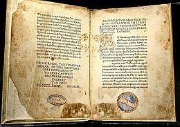
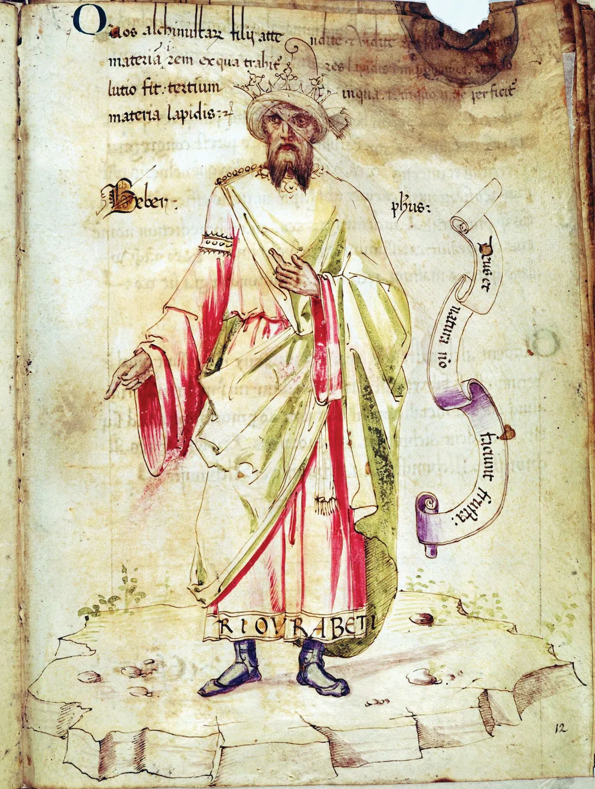
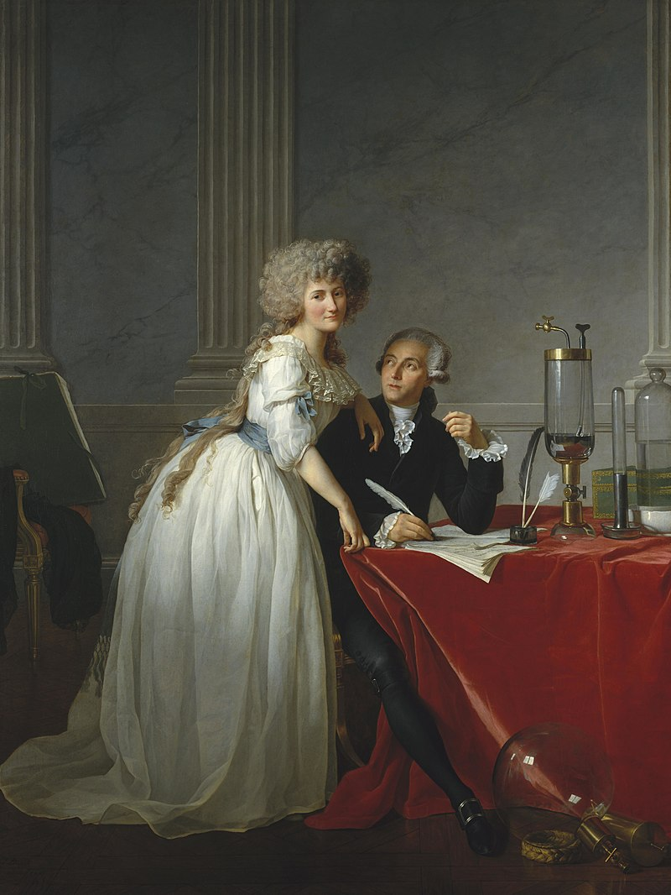

# Lesson 9: Chemistry in the Ancient World
{: .no_toc}

1. TOC
{:toc}

## Objectives

1. Learn about the history of alchemy and chemistry in antiquity
2. Explore the effect of the classical tradition on alchemy and chemistry in the Renaissance

## Ancient Notions of Chemistry

The foundations of chemistry can be traced back to ancient civilizations, where early thinkers began to explore the properties and transformations of materials. In Mesopotamia, around 3000 BCE, the emergence of writing allowed for the documentation of various techniques and recipes for making materials like glass and ceramics. The Sumerians and Babylonians recorded their knowledge on clay tablets, which included observations about the reactions of different substances. Such early documentation is crucial, as it represents the transition from oral tradition to recorded knowledge, enabling the sharing and accumulation of chemical understanding over generations. These practices highlighted an early awareness of the relationships between different materials, even if the underlying principles were not yet understood.

 In ancient Egypt, practitioners engaged in metallurgy and the preparation of medicines, laying the groundwork for systematic experimentation. The Egyptians used natural resources like minerals and plants in what we might call the precursory to organic chemistry. Though they might not have called it by these names, they understood the process of decomposition and how to circumvent it with mummification. The Egyptians also understood the basics of color compounds in the production and mixing of dyes for structures, textiles, and decorative purposes. The Egyptians were also adept glassmakers who melted, shaped, and colored glass for a variety of practical and decorative uses.

The ancient Greeks were particularly influential in shaping the philosophical aspects of chemistry. The philosopher **Empedocles** proposed that all matter was composed of four elements: earth, air, fire, and water. This elemental theory influenced later alchemical thought and established a framework that would persist for centuries. Though these ideas lacked empirical support, they were reflective of the way that natural sciences were initially approached in Ancient Greece&mdash; as little more than another philosophical thought exercise.

## Atomic Theory in Ancient Greece

The concept of atomic theory emerged in ancient Greece through the ideas of philosophers such as **Democritus**. Democritus proposed that all matter was composed of indivisible particles called "atomos," meaning "uncuttable" in Greek. This idea suggested that if you were to keep dividing a substance, you would eventually reach a point where it could no longer be divided. The atomic concept introduced a more mechanistic view of the natural world, encouraging further exploration of matter’s fundamental nature.

Democritus and his followers believed that atoms were eternal and unchanging, differing only in shape, size, and arrangement. This idea laid the groundwork for understanding chemical reactions as rearrangements of these atoms. Although largely philosophical and speculative, their ideas would resurface in the 19th century as modern atomic theory gained traction. The Greek emphasis on reason and observation played a pivotal role in promoting a systematic inquiry into the nature of substances, influencing subsequent generations of thinkers.

In contrast, Aristotle rejected the notion of indivisible atoms, proposing instead that all matter was composed of the four classical elements suggested by Empedocles. His views dominated scientific thought for centuries, largely due to his authoritative position in philosophy and science. Nevertheless, the seeds of atomic theory planted by Democritus persisted in the writings of later scholars, who began to question Aristotle's framework. 

## Humoralism

Humoralism, a medical theory that dominated Western thought from ancient times until the early modern period, proposed that human health and temperament were governed by the balance of four bodily fluids or "humors": blood, phlegm, black bile, and yellow bile. Originating with Hippocrates and further developed by Galen, this theory linked the physical body to the natural world, suggesting that an imbalance in these humors could lead to illness or undesirable traits.

In the context of chemistry, humoralism promoted the idea that substances could have effects on the body based on their qualities. For instance, foods and medicines were classified according to their ability to produce heat, moisture, dryness, or coldness, mirroring the elemental qualities found in nature. This classification system laid the groundwork for early pharmacology and encouraged the study of natural substances as remedies.

However, this theory began to decline with the rise of more empirical approaches to science during the Renaissance. The advent of anatomical studies and the development of the scientific method led to a reevaluation of long-held beliefs about the body and its processes. Although humoralism laid important groundwork for early chemistry and medicine, its limitations became apparent as scholars sought more accurate explanations for health and disease.

{: .note}
> We'll discuss humoralism, anatomy, and medicine in more depth in Unit 4!

## Alchemy in Ancient Rome

Alchemy, a precursor to modern chemistry, flourished in ancient Rome as practitioners sought to understand and manipulate the properties of matter. This early form of chemistry was steeped in mysticism and philosophical inquiry, with the goal of not only transforming base metals into gold but also achieving personal and spiritual enlightenment. Alchemists believed that all substances contained a hidden essence or "spirit," which could be released through specific processes.

Roman alchemy was heavily influenced by earlier Greek thought, particularly the writings of philosophers like Plato and Aristotle, who discussed the nature of matter and change. The Romans contributed to the alchemical tradition by emphasizing the importance of practical techniques. They developed various methods of distillation, calcination, and extraction, allowing for a deeper exploration of the properties of materials. This practical aspect marked a significant departure from the purely theoretical focus of earlier philosophical inquiries, setting the stage for more systematic experimentation.

    

        
        <figcaption style="text-align: left; margin-top: 5px;"><i>A manuscript of the Corpus Hermeticum. Image credit: Wikipedia</i></figcaption>
    

    
One of the most significant texts of Roman alchemy was the <i>Corpus Hermeticum</i>, attributed to <b>Hermes Trismegistus</b>, which synthesized various philosophical and alchemical ideas. This collection of writings discussed the concept of the philosopher's stone—a legendary substance that could turn lead into gold and grant immortality. Such ideas captivated the imagination of both scholars and the general public, elevating alchemy to a prominent status in Roman culture. The pursuit of the philosopher's stone became a symbol of the quest for knowledge and transformation, representing both material and spiritual goals.

    
 

As the Roman Empire began to decline, the knowledge and practices of alchemy were preserved and further developed in the Islamic Golden Age. The works of Roman alchemists were translated and expanded upon by scholars in the Middle East, ensuring the continuity of alchemical thought. This exchange of knowledge laid the groundwork for the Renaissance, when alchemy would evolve into the more empirical practice of chemistry.

## Islamic Alchemy

    

        
        <figcaption style="text-align: left; margin-top: 5px;"><i>A medieval depiction of Jabir. Image credit: Encyclopedia Britannica</i></figcaption>
    

    
Islamic contributions to alchemy and early chemistry marked a significant chapter in the history of science, bridging ancient Roman practices and the Renaissance. In fact, the word <i>alchemy</i> is itself derived from the Arabic term "al-kimia", which describes this practice of early chemistry. Though the decline and fall of the Roman Empire eventually halted the advancement of science in Rome, these studies flourished in the Middle East. <b>Abū Mūsā Jābir ibn Ḥayyān (Jabir)</b>, often referred to as the "father of chemistry", was a chemist, philosopher, pharmacist, and astronomer who lived in the early 9th century. He lived during the 8th century and was instrumental in transforming alchemical practices into a more systematic and experimental science. His extensive writings and innovations not only contributed to the understanding of chemical processes but also influenced subsequent generations of scholars in both the Islamic world and Europe.

    
 

Jabir's approach to alchemy was characterized by a focus on experimentation and empirical observation. Unlike earlier alchemical traditions, which often relied on mysticism and philosophical speculation, Jabir emphasized the importance of practical work in laboratories. He developed various apparatuses, such as the *alembic*, which was essential for distillation processes. His methodologies helped establish a more rigorous experimental framework, enabling the replication of results and fostering a scientific approach to understanding materials and their transformations.

One of Jabir's key contributions to alchemy was his classification of substances based on their properties and behaviors. He introduced a systematic approach to categorizing elements, which included concepts such as the four basic elements (earth, water, air, and fire) and the three essential principles (mercury, sulfur, and salt). Jabir's systematic observations and classifications were vital for the transition from alchemical mysticism to a more scientific understanding of chemical substances.

In addition to his classification system, Jabir is credited with developing numerous chemical processes and reactions. He explored the preparation of various acids, such as nitric and sulfuric acids, and discovered techniques for extracting metals from ores. His works, such as the "Book of Secrets" and the "Book of the Composition of Alchemical Water," detail various chemical processes that reflect a deep understanding of material transformations. These texts served as essential resources for future chemists and alchemists, influencing both Islamic and European alchemical practices for centuries.

Jabir's impact extended beyond the realm of chemistry; he also integrated philosophical and mystical elements into his works. His writings often reflected a synthesis of Greek philosophy, particularly Aristotelian concepts, and Islamic thought. This blend of ideas allowed Jabir to address broader questions about the nature of matter and existence, framing chemistry within a larger cosmological context. His philosophical inquiries contributed to the intellectual tradition of the Islamic Golden Age, where science, philosophy, and theology intersected.

Jabir's legacy in alchemy and early chemistry is profound. His emphasis on experimentation, systematic classification, and the development of chemical processes laid a crucial foundation for modern chemistry. By bridging the gap between ancient alchemical traditions and the scientific methods of the later Renaissance, Jabir not only advanced the field of chemistry but also fostered a spirit of inquiry and innovation that continues to resonate in scientific exploration today. His work remains a testament to the rich heritage of Islamic science and its enduring influence on the development of modern scientific thought.

## From Alchemy to Chemistry

 By the late Renaissance, European scholars who had been in contact with the Islamic world began to question the mystical and often untestable claims of alchemy. This period saw the rise of the scientific method, emphasizing observation, experimentation, and the reproducibility of results.
 

    

        
        <figcaption style="text-align: left; margin-top: 5px;"><i>Robert Boyle. Image credit: Science History Institute</i></figcaption>
    

    
Irish chemist Robert Boyle (below), often referred to as the "father of modern chemistry," made significant contributions to the discipline in the 17th century. His landmark work, "The Sceptical Chymist," published in 1661, challenged the classical notions of alchemical practice, particularly the belief in the four elements. Boyle proposed that matter was composed of various "corpuscles" or particles, leading to a more modern understanding of chemical substances. His emphasis on experimental evidence demonstrated that substances could be analyzed and understood through careful investigation and measurement. By advocating for a scientific method that emphasized quantification and repeatability, Boyle laid the groundwork for the systematic and empirical approach that would define modern chemistry.

    
 

    

        
        <figcaption style="text-align: left; margin-top: 5px; "><i>Antoine Lavoisier (right) and his wife, Marie-Anne Paulze Lavoisier (left). Image credit: Wikipedia</i></figcaption>
    

    
The French chemist Antoine Lavoisier further revolutionized chemistry in the late 18th century. His seminal work, "Elements of Chemistry," published in 1789, introduced the law of conservation of mass, which states that matter is neither created nor destroyed in chemical reactions. Lavoisier meticulously documented his experiments, demonstrating that chemical reactions involve the rearrangement of atoms rather than the creation or annihilation of matter. This shift in understanding helped dismantle the <b>phlogiston theory</b>—an alchemical idea that posited a fire-like element was released during combustion. Lavoisier's work not only transformed the theoretical landscape of chemistry but also established a new chemical nomenclature that moved away from the symbolic and often esoteric language of alchemy, making the subject more accessible and universally understood.

    
 

{: .note}
> We would not have most of Lavoisier's work without the talents and efforts of his wife, Marie-Anne Paulze Lavoisier. She translated his work for an international audience during his lifetime and ensured that his discoveries would not be lost during the Reign of Terror (during which M. Lavoisier was executed).

The late 18th and early 19th centuries witnessed the emergence of new laboratory techniques and equipment that were pivotal in advancing the field of chemistry. The development of glassware such as flasks, beakers, and distillation apparatus allowed chemists to conduct more precise experiments. These advancements facilitated the systematic study of chemical substances and their reactions, further distancing the practice from its alchemical roots. The establishment of chemistry as a distinct scientific discipline became evident as institutions and journals dedicated to chemical research began to emerge, culminating in the founding of the first chemistry journal, *Annalen der Chemie*, in 1800.

The evolution of chemistry during this period was not only theoretical but also deeply interconnected with technological advancements. The Industrial Revolution of the late 18th and early 19th centuries spurred the demand for chemical processes in manufacturing, leading to innovations in chemical engineering and industrial chemistry. The ability to produce synthetic dyes, fertilizers, and pharmaceuticals transformed both industry and society, illustrating the practical implications of the shift from alchemy to modern chemistry.

## Vocabulary List

| Root          | Language of origin    | Meaning                   | Example           |
| :---:         | :---:                 | :---                      | :---              |
| aer           | Greek                 | air, gas                  | aerate            |
| pyr(o)        | Greek                 | fire                      | pyromania         |
| techn(o)      | Greek                 | skill                     | technology        |
| onym          | Greek                 | name                      | homonym           |
| soph          | Greek                 | wisdom                    | sophisticated     |
| arch(ae)      | Greek                 | old, ancient, beginning   | archaeology       |
| pale(o)       | Greek                 | old                       | paleography       |
| ont           | Greek                 | being                     | ontology          |
| (h)od         | Greek                 | road, way                 | diode             |
| quant         | Latin                 | number, count, amount     | quantity          |
| still(a)      | Latin                 | drop (as of liquids)      | distill           |
| anim(a)       | Latin                 | soul, spirit              | animate           |
| nomin/nomen   | Latin                 | name                      | nominate          |
| lust(e)r      | Latin                 | light (n.)                | luster            |
| hum(o/i)      | Latin                 | moisture                  | humid             |
| nov           | Latin                 | new                       | renovate          |
| pract         | Latin                 | to do, to act             | practice          |
| sequ(e)       | Latin                 | to follow                 | sequence          |
| mit(t)/mis(s) | Latin                 | to send                   | submit            |
| tract/trah    | Latin                 | to drag                   | tractor           |
| vect/veh      | Latin                 | to carry                  | convection        |
| ced(e)/cess   | Latin                 | to withdraw, to yield     | concede           |

## Vocabulary Practice

**Practice Set A:** Identify the roots in each of the following words, give their language of origin, and their definitions. Also give their part of speech. Then, following the guidelines in Lesson 4, arrange the definitions of the individual roots to create a literal definition.

1. method
2. illustrative
3. quantify
4. innovation
5. decompose
6. paleontology
7. distillation
8. invection
9. retract
10. practitioner
11. exanimate
12. transmitter
13. intercession
14. pyrotechnics
15. anonymize
16. denomination
17. remission
18. practicality
19. anode
20. aerodynamic

## Reflection Questions

1. Metallurgy, paints, dyes, and glassmaking were among the earliest expressions of chemistry in ancient civilizations. Look up one of these practices from an ancient civilization *outside* the Mediterranean (e.g., the Americas, Australia, Africa, Asia) and describe how it demonstrates this civilization's understanding of chemical processes.
2. Empedocles believed that there were four elements: fire, air, earth, and water. Where else have you seen the four classical elements in the modern day (e.g., in popular media or modern philosophy)?
3. The word *atom* comes from the Greek word for uncuttable. Is this an appropriate name, given what we know now about subatomic structures? Why or why not?
4. In what ways was Islamic alchemy similar and different from Ancient Greek and Roman alchemy? In what ways was Islamic alchemy similar and different from early European chemistry?