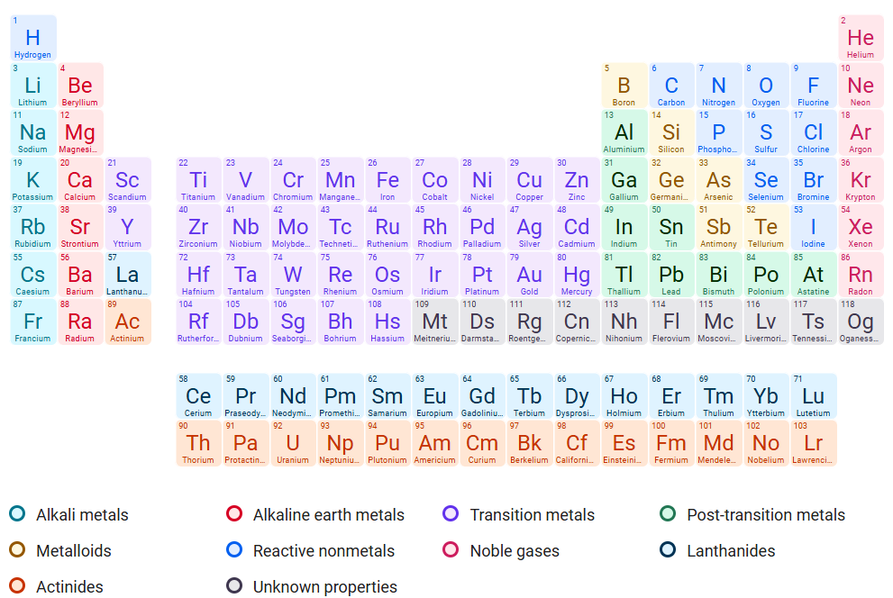

# Project 2: Compounding Terms 🔬
{: .no_toc}

## Objectives
{: .no_toc}

1. Apply knowledge of Greek and Latin roots to determine meanings of elements and compounds
2. Understand how endings change the meanings of words
3. Connect naming conventions with the shapes and structures of chemical compounds

## Relevance
{: .no_toc}

In this project, you will examine the names of elements and chemical compounds to explore how endings affect the meanings of these names. While the bases in chemical names can provide clearer clues to their core components, the endings are important when it comes to figuring out more details about chemical properties, bonds, and structures. By interpreting how Greek and Latin are used in chemical naming, you'll develop a better sense for the subtle ways in which endings can provide more information about unfamiliar terms.

A copy of the periodic table is provided here, for your reference.

1. TOC
{:toc}

## Problem 1: Elementary, My Dear Watson

The following elements from the periodic table use Latin- or Greek-based names with diminutive endings. Interpret the meanings of each of the elements' names. Then, look up what the element is used for/in and tell whether you think this name is appropriate or not. Recall that a diminutive just means "little"!

1. Helium
2. Lithium
3. Chromium
4. Tellurium
5. Radium

## Problem 2: Gods Against Humanity

These elements all include references to Greek and Roman mythological figures in their names. Give the figure, what the figure represents, and why the element was named after that figure. Then, tell whether you think this name is appropriate. (Think back to the discussions about Linnaeus' tendency to name organisms after his friends.)

1. Titanium
2. Promethium
3. Plutonium
4. Tantalum
5. Palladium

## Problem 3: It's a Numbers Game

Use number prefixes to match chemical names to their formulae. (When there's no number prefix, you may assume that there is only one of that element)

| Chemical Name             | Chemical Formula      |
| :---                      | :---                  |
| 1. Silicon dioxide        | A. CO                 |
| 2. Dihydrogen oxide       | B. N2O     |
| 3. Dinitrous oxide        | C. SiO2    |
| 4. Carbon monoxide        | D. NF3     |
| 5. Nitrogen Trifluoride   | E. H2O     |
| 6. Carbon Tetrachloride   | F. CCl4    |

## Problem 4: Another Happy Ending

Using context clues to figure out the patterns in each of the following groups of chemical compounds with the same ending. In other words, what do each of these compounds have in common? 

(Hint: look for elements or numbers in common!)

#### -ate

- Calcium carbonate (CaCO3)
- Sodium bicarbonate (NaHCO3)
- Potassium nitrate (KNO3)
- Iron phosphate (FePO4)
- Calcum sulfate (CaSO4)

#### -ide

- Sodium chloride (NaCl)
- Iron sulfide (FeS)
- Potassium bromide (KBr)
- Titanium aluminide (TiAl)
- Magnesium oxide (MgO)

### -ane

- Methane (CH4)
- Ethane (C2H6)
- Propane (C3H8)
- Butane (C4H10)
- Octane (C8H18)

## Problem 5: A Test of Metal

Recall that Roman numerals are used to indicate oxidation levels in transition metals. Further, for metals with multiple possible oxidation levels, the suffix *-ic* is used to indicate **higher** oxidation state, and the suffix *-ous* is used to indicate **lower** oxidation state.

For each of the following pairs of metallic compounds, give the oxidation level of *both* metals using the provided Roman numerals. Then, by comparing the two compounds, tell which is the *-ic* compound and which is the *-ous* compound. (You will only have one of each.)

1. Iron (III) Sulfate, Iron (II) Fumarate
2. Copper (I) Chloride, Copper (II) Oxide
3. Tin (IV) Chloride, Tin (II) Fluoride
4. Lead (II) Nitrate, Lead (IV) Acetate
5. Vanadium (IV) Oxide, Vanadium (III) Chloride

## Problem 6: Elements Unun-ymous

Each of the following names is no longer used for the last few synthetic elements in the periodic table. For each of the deprecated names, give the current name of the same element. Then tell what/who the element's current name is derived from (i.e., not the deprecated names).

(Hint: Do you recognize any of these numbers? They might help you find these elements on the table!)

1. unununium
2. ununbium
3. ununtrium
4. ununquadium
5. ununpentium
6. ununhexium
7. ununseptium
8. ununoctium

## Challenge Problem: Simple Symbols

Some elements' chemical symbols come from their Latin names instead of their English names. Pick one such element and write a short essay about it (200-300 words). Include the following details:

- The element's Latin name and what it means
- When the element was discovered
- When the element was added to the periodic table
- Why the element's Latin name is used instead of its English one
- Historical details about how the element was used or considered by pre-modern scientists
- How the element is used today

Examples include (but are not limited to):

- Sodium (Na)
- Potassium (K)
- Iron (Fe)
- Silver (Ag)
- Gold (Au)
- Tin (Sn)
- Mercury (Hg)
- Antimony (Sb)
- Copper (Cu)
- Lead (Pb)

{: .important}
> Make sure to include all resources you consulted for this project at the end of your submission, including any logs for approved AI usage. For more details, please refer to the Academic Integrity policy in the course syllabus. These do not need to be formal citations, but you should list what sources you used for each question.
