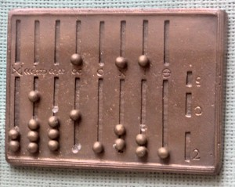
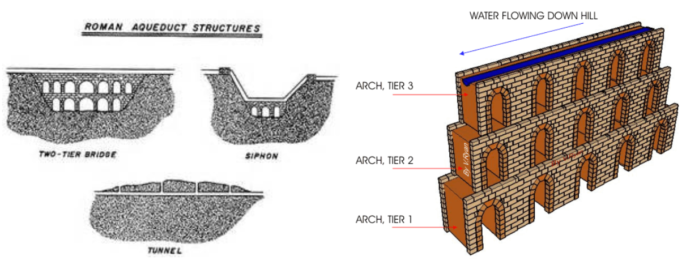
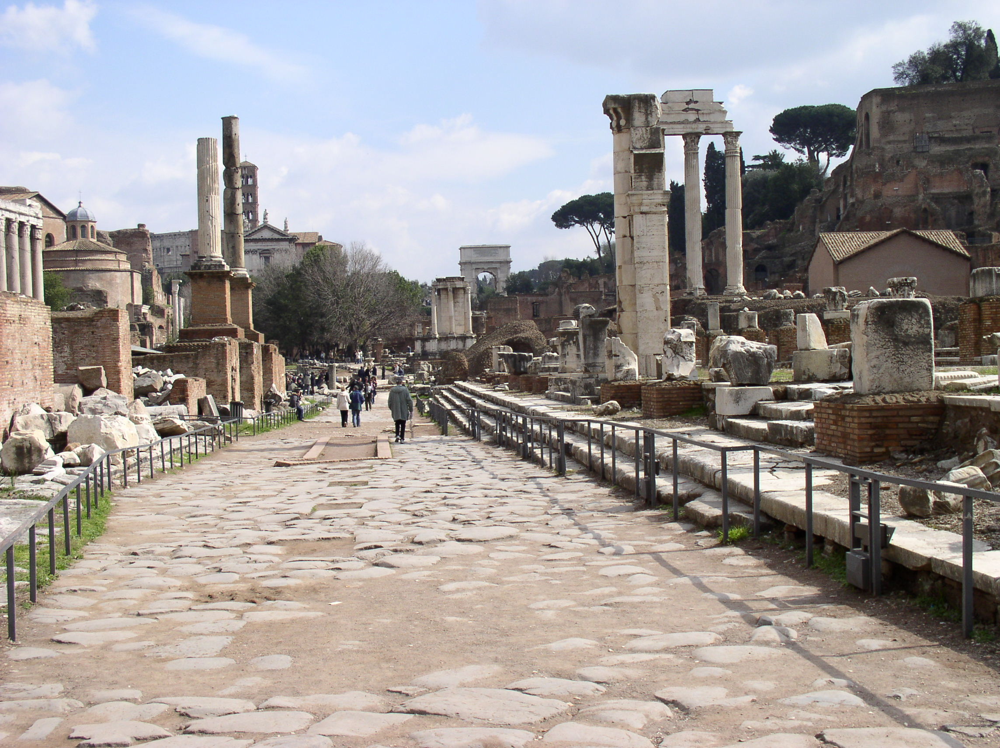
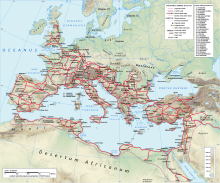
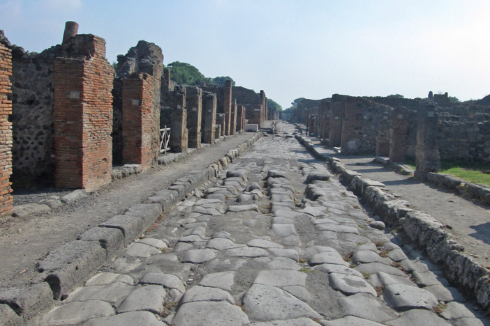
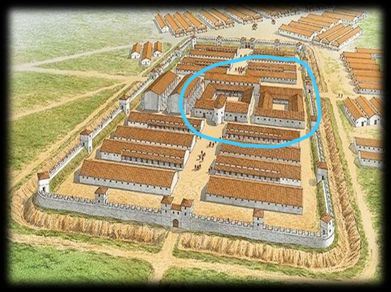

# Lesson 12: Mathematics in Ancient Rome
{: .no_toc}

1. TOC
{:toc}

## Objectives

1. Learn methods of Roman arithmetic
2. Discover the ways in which Romans used engineering and practical math

## Roman Numerals Review

Recall that the Roman numeral system is based on letters to represent numeric values. Roman numerals are formed by combining letters in order from greatest values to least values, then adding them together. Here is a numeral-to-number conversion chart, for your convenience:

| Roman Numeral | Hindu-Arabic Value |
| :---:         | :---:              |
| I             | 1                  |
| V             | 5                  |
| X             | 10                 |
| L             | 50                 |
| C             | 100                |
| D             | 500                |
| M             | 1000               |

As an example, the Roman numeral XVII would be 10 + 5 + 1 + 1 = 17.

## Roman Arithmetic

Let's go a step further and look at methods of Roman arithmetic.

### Addition

When you were first taught addition, you were likely taught to take two or more numbers, arrange them so that their place values align, and then you would go place by place and add up all the values in each place. You would add up your ones, your tens, your hundreds and so on. When you arrived at a value that exceeded ten, you would keep the terminal value but regroup the other value. Repeat until you were done.

The Roman number system isn’t base-10 the way our modern Hindu-Arabic number system is. But there is the idea of arrangements and pseudo-place values. As such, the steps of Roman arithmetic follow three steps:

1. Take two or more numbers and put their combined letters together, ordering them from greatest to least.

> 14 + 39:  
> XIIII + XXXVIIIII = XIIIIXXXVIIII &rarr; XXXXVIIIIIIII

2. Make conversions as necessary, starting from the smallest letters to the largest ones.

> XXXXV**IIIII**III &rarr; XXXX**VV**III &rarr; **XXXXX**III &rarr; LIII

3. Interpret the sum.

> LIII = 50 + 1 + 1 + 1 = **53**

Try verifying with a calculator, or by hand!

{: .note}
> This method requires you to use the additive representation of numbers. Try using the subtractive representations instead. Does the method work?

### Subtraction

With subtraction, unlike addition, you can only use two numbers at a time. Roman subtraction is a four-step process:

1. Set up the two numbers:

> 37 - 14  
> XXXVII - XIIII

2. Cross out or erase any letter in the first number that does not appear in the second one.

> XX~~X~~V~~II~~ - ~~XII~~II &rarr; XXV - II

3. Convert the smallest letter of the first number that is greater than the largest letter of the second, and repeat until there are no more letters in the second number.

> XX**V** - II &rarr; XX**IIIII** - II  
> XXIII~~II~~ - ~~II~~ = XXIII

4. Interpret the remaining numbers.
> XXIII = 10 + 10 + 1 + 1 + 1 = 23

Try verifying this as well!

### Multiplication

The Romans also had an interesting way they did multiplication. Let's explore the algorithm for how they do this first before giving the example. 

1. Can only multiply two numbers at a time. Set the two up in a table.

2. Take repeated halves for the first number by subtraction and take repeated doubles for the second number by addition, ignoring any remainders (or flooring).

3. Cross out any row where the “half” column is even.

4. Add the remaining “doubles”.

Let's look at the expression 14 * 39. We start by putting these two numbers into a Halves/Doubles table.

| Halves    | Doubles   |
| :---      | :---      |
| 14        | 39        |

Here I've put the number 14 on the left side and the number 39 on the right side. Traditionally, the smaller number is put on the left side because there are fewer halves to go through.

The second step is to keep continually taking halves of these numbers while disregarding any remainders or decimal places. For example, when you move from seven to three, seven divided by two would be 3.5 or three remainder one. You get rid of the remainder, or you just use the floor function, and you are left with 3. Then three divided by two, floored, is going to be one again.

Now, for each time that you take a half, you would double the number in the doubles column using addition:

| Halves    | Doubles   |
| :---      | :---      |
| 14        | 39        |
| 7         | 78        |
| 3         | 156       |
| 1         | 312       |

Once the table is complete, we then cross out any row where the number in the “half” column is even. Here, because 14 is even, we cross out the entire row of 14 and 39. Seven, three and one are all odd, so their respective rows get to stay as they are.

| Halves    | Doubles   |
| :---      | :---      |
| ~~14~~    | ~~39~~    |
| 7         | 78        |
| 3         | 156       |
| 1         | 312       |

Finally, the last step is taking all of the numbers from the doubles column and adding them together. So we have 78, 156 and 312. And then we use the regular method of addition to arrive at 546. You can try out the addition here for yourself, if you’d like. You can actually verify with your calculator that 14 times 39 is indeed 546.

The Romans probably had some idea of the commutativity of multiplication, meaning it doesn't actually matter which number starts off in which column, but it certainly makes your life easier if the smaller number is put into the halves column. If we had 39 on the left, we’d have to go through 39, then 19, then 9, then 4, then 2, then 1, which is six rows. When we started at 14, we only had to do four rows!

### Division?

Did the Romans have division? Not exactly. Practically speaking, they had some concept of unit fractions, as in being one part out of two, one part out of six, one part out of eight, et cetera. But there's no real concept of division. They didn’t really have any concept of more complex fractions that we have, such as five-eights or two-sevenths. 

They did have the idea of division in terms of monetary units, because monetary units in the Roman Empire were given in twelfths. So you could have one-twelfth of something, you could have one-sixth of something, one-fourth, one-third and one-half, and you could probably do addition between all of these as well. There must have been some concept of common factors, since there was an awareness that six, four, and three all divide 12. But in terms of division, the way that we could conceive of it in the modern day, there was no real equivalent in the Roman world or any intuitions or algorithms for solving those kinds of problems.

This is interesting because the words decimal and percent are both from Latin. The word decimal has the root for the word ten, *decem*, and "percent" can be broken down further into *per* + *cent*. But there really is no evidence for understanding either what a decimal or a percent is in ancient Rome, at least the way that we conceive of these in the modern day.

    

        
        <figcaption style="text-align: left; margin-top: 5px;"><i>A bronze Roman hand abacus. Image credit: Wikipedia</i></figcaption>
    

    
Here's one example of an abacus that could have been used in Rome. This would have mostly been used for people who were merchants or real estate brokers, people who were looking at divisions of land or calculating sums of money. If you'll notice, there are three divots on the far right-hand side that don't have any beads in them. Some scholars think that those divots were used to represent units of money or land value, maybe negative values, but we’re not completely sure. For the most part, there wasn't a lot of practical math in terms of arithmetic, certainly not something as advanced as even basic algebra, and certainly calculus, the way that we would understand today.

    
 

{: .note}
> The name for the stones in an abacus or those used as weights were called *calculi* (singular *calculus*). From what you know of roots and diminutives, what does *calculus* literally mean?

Numbers, as far as the numeric system introduced in Lesson 7, were mostly used for records and inscriptions. These would be things like determining somebody's age or the year, or maybe even the number of people in a certain legion or military faction. While the Romans did practice simple arithmetic, these were practically done on hand abaci, rather than written out with the methods introduced above.

## Roman Engineering

The Romans were also incredible engineers. Part of the reason that the Roman empire was able to spread as far as it did was due to the advances in civil engineering and infrastructure.

### Aqueducts

  
*The Pont du Gard, a Roman aqueduct in France with three layers of arches. Image credit: National Geographic Education.*

One of the most famous, recognizable feats of Roman engineering was the aqueduct (*aqua* + *duct* = "leading water"). The aqueducts were part of a giant water supply system for both irrigation and purification. They were created to move water from reservoirs or basins into different parts of Rome. And because about 80% to 90% of the economy was built on agriculture, it was important to have a way to water all sizes and manners of fields, especially as Rome grew bigger. The development of aqueducts ensured that agriculture could thrive at a time when the economy and people's forms of payment were very dependent on it. 

The way that the aqueducts were designed also lent itself to a sort of proto-system of water purification. Below are a couple of diagrams that can help illustrate the way they work. Aqueducts were constructed in layers, represented by the different colors. The layers would be constructed in such a way that water would flow across the top of the aqueduct and continuously be flowing downhill. As the water flowed, any sediment or impurities would naturally drop out into the gravel that filled the aqueduct layers.

Often, when we think about aqueducts, we imagine these distinctive arch patterns. These are called **arcades**. The arches aren’t just decorative–they’re actually a clever way to both conserve resources and control the flow of water. An arch, when constructed well, can support the same amount of weight that a full wall would, with about half the materials. Additionally&mdash;and it’s not obvious from this picture&mdash;but when two arches are placed next to each other, there’s a natural divot between them, a sort of valley between the two vertices of the arches. The Romans didn’t fill these in, so that the water would continually move up and down. It only looks like a filled-in wall on the outside, so that the water doesn’t leak out. Arches are also important because they can support weight better than perpendicular columns, particularly when the weights that they support are composed of many small bricks instead of a large stone slab. Because the stones in the middle of the arch are already held in place through tension and compression, there’s no need to create additional support structures for smaller brick layers.

Many aqueducts were built during the Republic, but there wasn't much upkeep or maintenance on them until Augustus became the first emperor. Augustus had a friend named Marcus Vipsanius Agrippa, who was an architect and civil engineer. Agrippa pioneered the renovation of much of the Roman infrastructure, including standardizing Roman aqueducts and improving their water flow.

What's really cool about the aqueducts is that they were built all over the Roman Empire–many of which you can still see today! The Romans actually got about as far as Spain and France at the height of their conquest, so there are surviving aqueducts in these regions.

### Sewers

A cousin of the aqueduct is the Roman drainage system. Some aqueducts themselves were tunnels, whose primary function was to remove unwanted water and waste. One of the things that kind of set Rome apart from many of the other contemporary civilizations and cultures of its time is that it actually did have a pretty well functioning drainage system. 

Rome is situated around the Tiber River, surrounded by hills and lowlands, which means that there are many natural springs. The combination of these led to many concerns about flooding. Seattle is actually a good analogue here, since there are a lot of hills downtown with not many storm drains. If you’ve ever been downtown on a particularly rainy day, you’ll notice that the rainwater gathers in the lowlands; without an effective way of draining that water, roads and buildings will get submerged and damaged. Rome's drainage system first started out as a way to mitigate flood concerns, but eventually it also turned into a way to get rid of any waste or get rid of sewage. 

Modern sewage systems depend on indoor plumbing, which includes a series of pipes that takes things into sewers and then deposits them into a waste. The Romans didn't actually have a lot of indoor plumbing. There were very few indoor household toilets, so most waste was usually dumped straight into the streets. The streets were a more reliable way of making sure that the waste actually got into the sewers. Further, if the sewers were attached to people's houses, a lot of the disease and filth that went through them would have appeared in people’s homes. In addition to that, the sewers were home to rats, flies, and other pests. Thus, in addition to disease and human waste, there was the risk of an infestation of rats or other creatures. 

{: .note}
> The Roman writer named Aelian recounts a story about a sewage opening near a fishery. He wrote that there was a very persistent octopus that lived in a sewer next to the fish market. Every once in a while, it would creep out, steal some fish, and make off with them. So, in other words, you could get quite unexpected visitors if you had the sewage openings right near your house or even your place of commerce!

### Roads

  
*The Via Sacra, in Rome. Image credit: Wikipedia*

There were three kinds of roads that were recognized or used during the Roman Empire. The **via** (plural **viae**) is a general-purpose, large road, usually outside the city of Rome, some within the city of Rome as well, being named after famous people or the people who constructed them. One example is the *Via Sacra*, which just means “sacred road”, which is where all the temples were at and where festivals and processions would take place. During the Roman Empire, the via would have been considered larger roads that are usually outside the city of Rome. If you look at a map of Europe today and look at the major roads there, and you compare it against a map of where the ancient Roman roads were, you'll notice that a lot of the routes are the same. That’s also where we also get the saying that “all roads lead to Rome”. 

  
*A map of Roman roads in Europe. Image credit: Wikipedia*

The **vicus** is the flat in-city road (plural **vici**), while the **clivus** (plural **clivi**) is the inclined in-city road. The early roads at the founding of the Roman city and during the monarchy probably would have been paved only with dirt. However, as the city grew, more people used the roads. To keep them from wearing out and also to maintain their structural integrity, engineers would later add gravel and stone layers. Some of these roads, especially as they developed alongside the sewage system, would have gutters along the sides, and they would also have some stepping-stones, like a crosswalk.

  
*An excavated street in Pompeii, with stepping-stones and cart tracks. Image credit: World Archaeology*

### Military Engineering

Roads were also quite important for the military, which was also a huge source of engineering developments. As we saw in the health and medicine lesson, the military gave legitimacy to doctors; beyond that, they also gave legitimacy to engineers. The class of engineers were actually called *immunes* alongside the regular soldiers. This is where we get the word “immune” from. 

The *immunes* would have been soldiers first, but they were excused from normal military duties. They would have taken on roles similar to modern-day civil engineers. The engineers were also called *fabri*, which means “craftsmen”, or *architecti*, which means “arch-builders”. It’s important to realize that *architecti* didn’t only build arches, though. As the Roman army progressed, the soldiers would build their own roads, their own bridges, and other fortifications, including aqueducts, alongside the progression of the army. 

Most of these structures were designed to be deconstructed after use. Julius Caesar tells us quite a bit about military engineering during campaigns. One of the most famous bridges that his army built was along the Rhine river. His army built and deconstructed the same bridge across the river in about ten days. They built the bridge, they went across it, and then they packed it up.

The two exceptions to the "design to deconstruct" philosophy were roads and hospitals. Roads served a practical purpose not just to mark the passage of the military, but also to serve commercial purposes in conquered territories and provinces. It was also much more efficient to keep roads for messengers and moving the troops.

Military hospitals, called **valetudinaria** (singular **valetudinarium**), were left behind along with the roads because the wounded soldiers would often not be able to move with the rest of the army.

In this diagram of a Roman camp (also called the **castra**), the valetudinaria would have been positioned towards the center (the circled buildings). These were larger tents that would have been well-fortified to protect the wounded soldiers within.

{: .note}
> *Castra* is cognate with the toponym *-chester* in English. Any town or city in the UK that ends in *-chester* (like Manchester or Chichester) used to be a place where the Romans once set up a military camp. 

When they were not actively at war, the Roman army was essentially a battalion of construction workers. A Roman soldier's toolkit typically also would have included a shovel in addition to weapons, because the necessary construction work required much digging. Many Roman writers attest to the fact that when the army didn't really have anything to do, they would just be assigned civil engineering projects. It was believed that if the army didn't have anything to do, then they would try to mutiny or defect. The neat thing about this is that if you consider that all Roman men had mandatory military service, most of the Roman male population would have had this hands-on experience with engineering, even if they never learned it mathematically the way that engineering is taught today.

## Vocabulary List

| Root          | Language of origin    | Meaning                   | Example           |
| :---:         | :---:                 | :---                      | :---              |
| uncia         | Latin                 | one-twelfth (1/12)        | uncial            |
| ord(in)       | Latin                 | arrangement, order        | order             |
| angle/angul   | Latin                 | angle                     | triangle          |
| line(a)       | Latin                 | line                      | linear            |
| arc(h)        | Latin                 | arch                      | arch              |
| sin(e/u)      | Latin                 | curve                     | sine              |
| via           | Latin                 | way, road                 | trivia            |
| cliv          | Latin                 | slope                     | proclivity        |
| mun(er)       | Latin                 | wall, fortification       | munitions         |
| plumb         | Latin                 | lead (metal)              | plumbing          |
| rect/reg      | Latin                 | straight, regular         | rectangle         |
| plan          | Latin                 | flat                      | plane             |
| integ(e)r     | Latin                 | whole                     | integer           |
| put(e)        | Latin                 | to think                  | compute           |
| sec(t)        | Latin                 | to cut                    | section           |
| fabr(i)       | Latin                 | to craft                  | fabric            |
| tang(e)       | Latin                 | to touch                  | tangible          |
| struct        | Latin                 | to build                  | construct         |
| fract/frag    | Latin                 | to break                  | fragile           |
| monstr        | Latin                 | to show                   | demonstrate       |
| tect          | Greek                 | to build                  | architect         |

## Vocabulary Practice

**Practice Set A:** Identify the roots in each of the following words, give their language of origin, and their definitions. Also give their part of speech. Then, following the guidelines in Lesson 4, arrange the definitions of the individual roots to create a literal definition.

1. collinearity
2. secant
3. arctangent
4. bisector
5. sinusoidal
6. viaduct
7. paraclival
8. fabrication
9. obstruct
10. irregular
11. fraction
12. differentiable
13. ordinary
14. imputation
15. integral

## Reflection Questions

1. Compare and contrast the methods of Roman arithmetic with the arithmetic we're familiar with (using Hindu-Arabic numerals). Which system is more efficient, and why?
2. Try your hand at some Roman arithmetic! Give a simple one-operation expression (with both numbers being at least 10, such as 29 + 14) and evaluate it according to the Roman method.
3. Look back at the map of Roman roads across Europe and recall how the Roman army was responsible for creating most of its own infrastructure. What can you imply from the distribution and spread of Roman roads?
4. What differences and similarities do you see between Greek and Roman mathematics?
5. Have you seen more Greek or Latin terms in the mathematics that you've done? Give examples.
