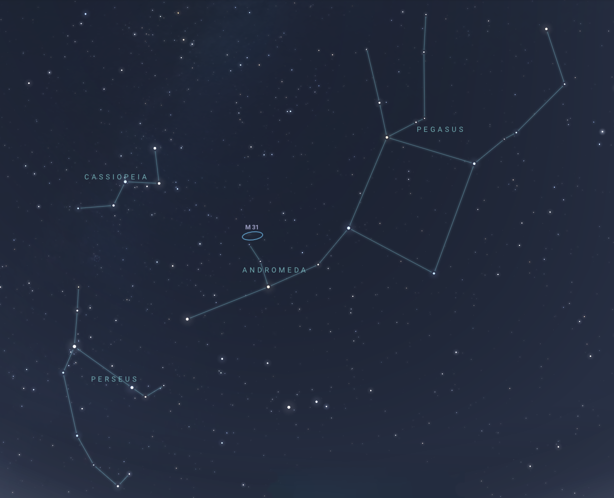
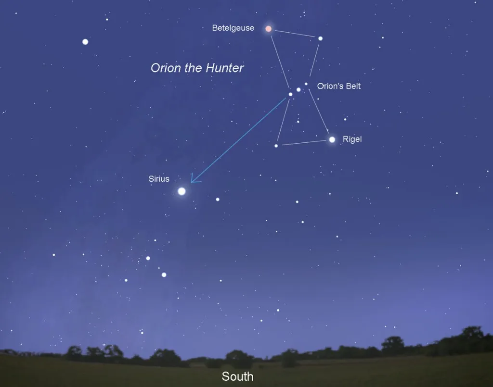

# Lesson 13: Pre-Modern Astronomy
{: .no_toc}

1. TOC
{:toc}

## Objectives

1. Learn about the ways that astronomy was practiced in the ancient Mediterranean
2. Explore the mythology behind celestial bodies
3. Compare astronomy in the ancient Mediterranean to other pre-modern civilizations

## Astronomy in Ancient Greece

Ancient civilizations relied heavily on celestial phenomena to guide their agricultural practices, navigate the seas, and develop calendars. The Greeks, Egyptians, and Babylonians made significant contributions to astronomy, each building upon the knowledge of the previous cultures. They employed simple tools like sundials, water clocks, and later, more sophisticated instruments like astrolabes, to track celestial movements and time.

The practice of **astronomy** in Ancient Greece was closely related to **astrology**, where celestial bodies were believed to influence human affairs. Planets, stars, the moon, and the sun were associated with deities and other mythological figures. The Greeks were among the first to distinguish between the movements of celestial bodies. They classified stars as either "fixed" stars, which remained in constant positions relative to each other, or "wandering" stars, which included the planets. This distinction highlighted their keen observational skills and their understanding of the cosmos as dynamic and complex. Greek astronomers meticulously recorded the positions of stars and planets, contributing to the development of star catalogs and early celestial maps. In addition to theoretical advancements, ancient Greek astronomy was closely tied to practical applications, such as navigation and agriculture. Farmers relied on astronomical observations to determine the best times for planting and harvesting, while sailors used the stars for navigation across the Mediterranean Sea.

### Anaximander

Anaximander, a student of Thales (from [Lesson 11](../lesson11-greek-math/index.md#thales)), made substantial advancements in astronomy and cosmology during the 6th century BCE. He is best known for proposing one of the earliest models of the universe, suggesting that the Earth floats freely in space, unsupported by anything beneath it. This radical idea contrasted sharply with earlier views and represented a significant step toward a more scientific understanding of the cosmos.

Anaximander introduced the concept of the "apeiron," or the infinite, as the source of all things. He believed that celestial bodies, including the sun, moon, and stars, were not divine entities but rather physical phenomena. This perspective marked a shift away from mythological interpretations, emphasizing a more naturalistic approach to understanding the universe.

He also created one of the first maps of the known world, which reflected his interest in geography and its relationship to celestial phenomena. Anaximander's work laid the groundwork for future philosophers and astronomers, influencing later natural philosophers like Ptolemy and Aristotle. In particular, Anaximander proposed a **geocentric** model of the universe, in which Earth was shaped like a cylinder and was at the center of the cosmos. His ideas about the cosmos and the Earth’s position within it continued to resonate throughout ancient Greek philosophy.

### Aristarchus of Samos

Aristarchus of Samos, active in the 3rd century BCE, is best known for his revolutionary heliocentric model of the solar system, proposing that the sun, rather than the Earth, was the center of the universe. This idea was groundbreaking, as it challenged the prevailing geocentric view set down by Anaximander (and later supported by Aristotle). Aristarchus argued that the stars were far away and that the Earth revolved around the sun, a concept that would not gain acceptance until centuries later.

In addition to his heliocentric theory, Aristarchus developed methods to estimate the distances and sizes of celestial bodies. He used geometric principles to calculate the relative distances of the sun and moon from Earth, although his methods were not precise by modern standards.

Despite the lack of widespread acceptance of his ideas during his lifetime, Aristarchus's work laid the groundwork for later astronomers, including Copernicus, who would revive and expand upon his heliocentric model. His contributions highlight the importance of critical thinking and observation in the development of scientific theories about the cosmos.

### Hipparchus of Nicaea

Hipparchus of Nicaea, active in the 2nd century BCE, is often regarded as one of the greatest astronomers of antiquity. He is best known for creating one of the earliest comprehensive star catalogs, which listed over 850 stars and included information on their positions and brightness. His meticulous observations and systematic approach to astronomy set a high standard for future astronomers.

One of Hipparchus's most notable contributions was the development of trigonometry for astronomical purposes. Until Hipparchus's time, trigonometry was only a small part of geometry, which was still more an art than a science. Hipparchus introduced methods for calculating the positions of celestial bodies using angles, which allowed for more accurate predictions of their movements. His work laid the groundwork for later advancements in navigation and celestial mechanics.

Hipparchus is also credited with the discovery of **precession**, the gradual shift in the orientation of Earth's axis. This understanding of precession allowed him to correct earlier astronomical models and refine the predictions of celestial events. His blending of observational data with mathematical techniques represented a significant advancement in the practice of astronomy. In particular, the understanding of precession is what helped Eratosthenes calculate the circumference of the earth about a century later.

Hipparchus's star catalogs and trigonometry-based models influenced later astronomers, including Ptolemy, who built upon his work. His emphasis on observation, measurement, and mathematical precision established fundamental principles that continue to guide astronomical practice today.

## Principles of Ptolemaic Astronomy

The Ptolemaic system, developed by Claudius Ptolemy in the 2nd century CE, was a geocentric model of the universe that dominated Western astronomy for over a millennium. Central to this system was the belief that the Earth was the immovable center of the universe, with the sun, moon, and planets revolving around it. This geocentric view was widely accepted and supported by philosophical and religious beliefs of the time.

Ptolemy introduced the concept of **epicycles** to explain the complex motions of planets. According to his model, each planet moved in a small circle (the **epicycle**) while simultaneously traveling along a larger circular orbit (the **deferent**) around the Earth. This arrangement allowed Ptolemy to account for the apparent retrograde motion of planets, where they seem to move backward in their orbits from the perspective of Earth.

Ptolemy's work, particularly the *Almagest* (as seen in [Lesson 11](../lesson11-greek-math/index.md#ptolemy)) included detailed observations, mathematical calculations, and more star catalogs. He compiled and refined the astronomical knowledge of his predecessors, providing a comprehensive framework for understanding celestial motions. His model was influential in both astronomy and astrology, as it provided a basis for predicting celestial events and their supposed impacts on earthly affairs.

Despite its widespread acceptance well into the Renaissance, the Ptolemaic system faced challenges as observations of celestial phenomena improved. Over time, discrepancies between predictions and observations led to calls for new models. In particular, the Ptolemaic system also relied on a geocentric model of the universe. Ultimately, the Ptolemaic system was replaced by the heliocentric model of Copernicus in the 16th century, but Ptolemy's contributions to astronomy laid the groundwork for future developments and helped shape the course of scientific inquiry for centuries.

## Roman Astronomy and Astrology

Roman astronomy was heavily influenced by earlier Greek models but adapted to fit Roman cultural and religious contexts. While the Greeks had laid the foundations for astronomical observation and theory, the Romans focused on practical applications of this knowledge, especially in agriculture, navigation, and timekeeping. The Roman calendar was significantly influenced by astronomical events, with festivals and agricultural practices often aligned with solar and lunar cycles.

Astrology played a significant role in Roman society, intertwining with their understanding of astronomy. The Romans believed that celestial phenomena could influence human affairs and were keen on astrological predictions. This belief was so pervasive that astrological practices became integral to Roman life, from the decisions of emperors to the everyday lives of common citizens. Prominent figures, such as Julius Caesar and Augustus, often consulted astrologers for guidance on political and military matters.

Despite their practical approach, Roman astronomy was often overshadowed by the mystical aspects of astrology. The belief that celestial movements could impact human fate led to a rich tradition of interpreting omens and prophecies based on planetary positions. This intertwining of astronomy and astrology reflects the broader Roman inclination to incorporate various cultural practices into their own.

## Celestial Mythology

### The Planets

In Roman mythology, the planets were named after gods and goddesses, reflecting their characteristics and roles within the pantheon. This practice drew heavily from earlier Greek traditions, where planets were also associated with divine figures. Each planet's name and mythology conveyed its significance to Roman culture, influencing how people perceived celestial bodies and their movements.

- **Mercury** (Mercurius) was named after the messenger god, embodying speed and communication. His swift nature was mirrored in the planet's rapid orbit around the sun.
- **Venus** (Venus) represented love and beauty, making it one of the most admired planets in the sky, often referred to as the "evening star" or "morning star."
- **Mars** (Mars), named after the god of war, symbolized aggression and conflict, which was fitting given its reddish hue reminiscent of blood.
- **Jupiter** (Iuppiter) was the king of the gods, representing power and authority, which aligned with its status as the largest planet in the solar system.
- **Saturn** (Saturnus) was associated with agriculture and time, reflecting the god's role in both harvest and the cyclical nature of life.
- **Uranus** and **Neptune**, while not known to the Romans, were later named after the Roman deities of the skies and the seas, further continuing the tradition of celestial naming based on mythology.

This practice of naming planets after deities not only provided a way to personify celestial bodies but also reinforced the Romans' connection between the heavens and their daily lives.

### Famous Constellations

#### The Big and Little Dippers

  
*Ursa major and Ursa minor. Image credit: EarthSky*

The Big Dipper (part of Ursa Major) and the Little Dipper (part of Ursa Minor) are two of the most recognized **asterisms** in the night sky. An **asterism** is a pattern of stars not recognized as a full constellation but which is distinct and familiar.

These constellations have deep mythological roots and played crucial roles in navigation and timekeeping. The Big Dipper, shaped like a ladle, is often associated with the myth of Callisto, a nymph transformed into a bear and placed among the stars by Zeus. Its position in the sky helps in locating Polaris, the North Star, which is situated at the end of the Little Dipper's handle.

For ancient Romans, these constellations were significant for agricultural planning and navigation. The visibility of the Big Dipper in the northern sky marked the changing seasons, aiding farmers in determining when to plant and harvest crops. The Little Dipper’s association with navigation was especially important for sailors, as it helped guide them during nighttime voyages.

In various cultures, these Dippers have been attributed different myths and meanings. The Romans, influenced by Greek traditions, incorporated these stories into their own celestial narratives, allowing these asterisms to endure in cultural memory.

#### Cassiopeia, Perseus, and Andromeda

  
*Cassiopeia, with its brightest star Shedar. Image credit: Star Registration*

The constellations of Cassiopeia, Perseus, and Andromeda are interconnected through a rich tapestry of mythology. In Greek mythology, Cassiopeia was a queen known for her beauty and vanity, often depicted sitting on her throne in the sky. Her pride insulted the goddess Hera, who demanded Cassiopeia's daughter, Andromeda, as a sacrifice to a sea monster. Perseus, the hero, rescued her, and the trio of constellations commemorates this legendary tale.

In Roman times, these constellations retained their Greek names and mythological associations, symbolizing heroism, sacrifice, and the consequences of hubris. The positioning of Cassiopeia, characterized by its distinctive W shape, makes it easily recognizable, while Andromeda, representing the chained princess, is notable for containing the Andromeda Galaxy, the nearest spiral galaxy to our own.

  
*Cassiopeia, Andromeda, and Perseus. With a cameo from Pegasus. Image credit: Night Sky Network.*

#### Orion, Scorpius, and Sirius

  
*Orion and Canis Major. Image credit: WIRED*

Orion, one of the most prominent constellations, is associated with the myth of a great hunter in both Greek and Roman traditions. The Romans adopted the Greek myth, viewing Orion as a symbol of strength and adventure. His representation in the night sky includes the iconic three stars that form his belt and the surrounding stars that outline his figure. Orion’s visibility during winter months made him a key constellation for ancient Romans, guiding farmers and seafarers alike.

Orion's belt points downwards towards Sirius, also called the Dog Star. Sirius is also the brightest star in the constellation Canis Major, who represents Orion's faithful hunting hound. Sirius is one of the brightest objects in the sky and an easy-to-spot star in the winter and early spring months. As such, this star also had associations with heat and fertility, since it indicated the time to start planting and farming again.

  
*Scorpius, with its notable stars indicated. Image credit: EarthSky*

Scorpius, on the other hand, represents the scorpion sent to kill Orion, creating a story of rivalry between hunter and prey. Scorpius is more visible during the summer months. The visibility of Orion and Scorpius during different seasons provided essential guidance for agriculture and navigation. The changing positions of these constellations marked the passage of time and the cycles of nature, highlighting the deep connection between mythology and practical life in Roman society.

#### Hercules

  
*The constellation Hercules, with notable stars. Image credit: Star Registration*

The constellation Hercules is named after the Greek hero known for his incredible strength and numerous legendary feats, including the Twelve Labors. Although not as prominently recognized as other constellations, Hercules was an important constellation for locating other key asterisms and constellations used in navigation, such as Lyra and Boötes.

In the night sky, Hercules is depicted as a kneeling figure, and it contains some notable stars and asterisms, including the Great Hercules Cluster (M13), a globular cluster that was admired by ancient stargazers. The constellation's visibility during summer months made it an important reference point for navigation and seasonal changes.

## Vocabulary List

| Root          | Language of origin    | Meaning                   | Example           |
| :---:         | :---:                 | :---                      | :---              |
| galac(t)      | Greek                 | milk                      | galaxy            |
| ast(e)r       | Greek                 | star                      | astronomy         |
| helio         | Greek                 | sun                       | helium            |
| selen(i)      | Greek                 | moon                      | selenium          |
| nyct(o)       | Greek                 | night                     | nyctophobia       |
| hemer(a)      | Greek                 | day                       | ephemeral         |
| eos           | Greek                 | dawn, rosy                | eosin             |
| cosm(o)       | Greek                 | whole, universal          | cosmos            |
| meteor(o)     | Greek                 | lofty, high above         | meteoroid         |
| plan(e)       | Greek                 | wandering                 | planet            |
| stell(a)      | Latin                 | star                      | stellar           |
| nebul         | Latin                 | mist                      | nebulous          |
| sol(a)        | Latin                 | sun                       | solar             |
| lun(a)        | Latin                 | moon                      | lunar             |
| c(a)elest     | Latin                 | sky, heavens              | celestial         |
| die/a         | Latin                 | day                       | quotidian         |
| noct/nox      | Latin                 | night                     | nocturnal         |
| vesper        | Latin                 | evening                   | vespers           |
| gibb          | Latin                 | hump                      | gibbon            |
| orb(it)       | Latin                 | circular                  | orbital           |
| grav(i)       | Latin                 | heavy                     | gravitas          |
| cresc(e)      | Latin                 | to grow                   | crescendo         |

## Vocabulary Practice

**Practice Set A:** Each of the following words is associated with one of the Roman deities who gives their name to a planet. Tell which deity the word is related to, and then tell what the relation is between the word and the deity. (You may look up the definitions in a dictionary)

1. saturnine
2. plutonium
3. venerate
4. martial
5. joviality

**Practice Set B:** Identify the roots in each of the following words, give their language of origin, and their definitions. Also give their part of speech. Then, following the guidelines in Lesson 4, arrange the definitions of the individual roots to create a literal definition.

1. exoplanet
2. interstellar
3. cosmology
4. nebula
5. constellation
6. crescent
7. asteroid
8. precession
9. epicycle
10. deferent
11. aphelion
12. eclipse
13. eccentric
14. gibbous
15. asterism
16. equinox
17. gravity
18. galaxy
19. crescent
20. meteorology

## Reflection Questions

1. Look up and briefly summarize the story behind any of the constellations in the Western Zodiac.
2. The Greek constellations were largely inherited from the Babylonians. Look up a Babylonian constellation and give its Greek (Western) equivalent. How are the two related, if at all?
3. Democritus's atomic theory and Aristarchus's heliocentric model were both theories that ended up being correct but were not widely accepted during their times. Compare and contrast the reception of these theories by their contemporaries and their rediscovery during the Scientific Revolution.
4. Math and astronomy were closely related disciplines in the ancient world. How do the ancient Greek astronomers fit in to the timeline of the ancient Greek mathematicians (from Lesson 11)?
5. The Greeks were not the only ones who came up with their own constellations! Look up the star catalogs or star maps from other civilizations and cultures and tell about one of the constellations there. Does it have a Greek equivalent?
