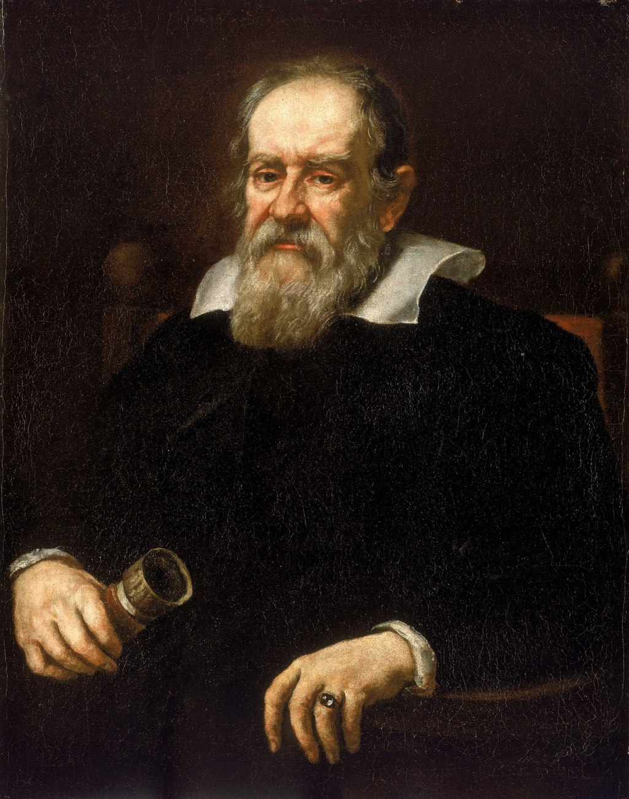
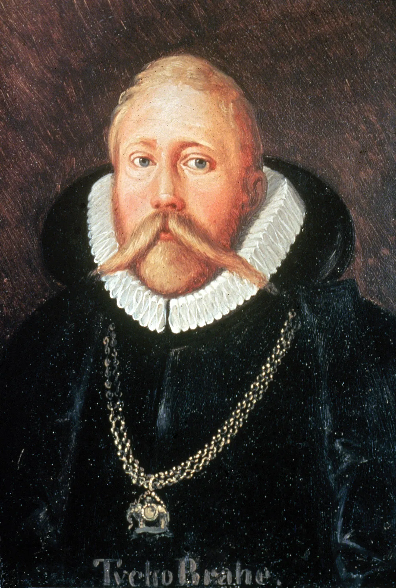

# Lesson 14: Modern Astronomy
{: .no_toc}

1. TOC
{:toc}

## Objectives

1. Learn about Latin and Greek in modern astronomy
2. Overview of Scientific Revolution and advances in astronomy

## The Scientific Revolution

The Scientific Revolution was a transformative period in the history of science, generally considered to have occurred between the 16th and 18th centuries. This era was characterized by a shift from the medieval, religious-based understanding of the universe to a more empirical, observation-based approach. The major developments of this period laid the foundation for modern science, with breakthroughs not just in astronomy, but also physics, biology, and chemistry. We've explored facets of the Scientific Revolution in other lessons, but now it's time to get a fuller context. The movement not only changed the way people viewed the natural world, but also redefined the role of human reason and inquiry in understanding the universe.

One of the core characteristics of the Scientific Revolution was the challenge to the established authority of ancient texts and church teachings. For centuries, ideas from Aristotle and Ptolemy, both of whom had made substantial contributions to science, were accepted without question. These views were aligned with the geocentric model, which placed Earth at the center of the universe. However, the scientists and philosophers of the revolution questioned these ideas, relying on observation and experimentation rather than blind adherence to tradition. This period marked the birth of the modern scientific method, with an emphasis on hypothesis, experimentation, and evidence.

The revolution was not just about individual discoveries, but also about the way in which knowledge was shared and debated. The printing press, developed and introduced by Johannes Gutenberg around 1440, played a crucial role in disseminating scientific ideas and findings across Europe. Though it was not the most accessible technology at first, typing and printing became essential for the quick spread of texts and the ideas within. As a result, the progress of science accelerated, and new ideas quickly gained traction. It was during this time that the first major scientific societies were formed, such as the Royal Society in England, which provided a space for collaboration and peer review.

{: .note}
> Systems of movable type and printing were already established in Korea and China prior to the creation of Gutenberg's printing press. The oldest extant book that was written solely through typing is the *Jikji* (직지). It is a collection of Korean Buddhist teachings published in 1377 during the Goryeo Dynasty. Gutenberg's first printed book, a German version of the Bible, was published in 1455.

### Copernicus and Heliocentrism

    

        
        <figcaption style="text-align: left; margin-top: 5px;"><i>A portrait of Nicolaus Copernicus. Image credit: Wikipedia</i></figcaption>
    

    
<b>Nicolaus Copernicus</b> (1473–1543), a Polish mathematician and astronomer, is best known for his development of the heliocentric model of the universe, which posited that the Earth and other planets revolved around the Sun. Before Copernicus, the prevailing model of the universe was the geocentric model, based on the writings of Ptolemy. The geocentric model held that the Earth was the center of the universe, and everything else, including the Sun and stars, revolved around it. This view was widely accepted for over 1,400 years, primarily because it aligned with religious and philosophical beliefs about the centrality of humanity.

    
 

Copernicus’s heliocentric theory, first detailed in his work *De revolutionibus orbium coelestium* (On the Revolutions of the Celestial Spheres) published in 1543, challenged the long-standing geocentric view. He proposed that the Earth was not the center of the universe, but instead, it orbited the Sun, just as the other planets did. This idea was revolutionary for its time, as it upended both scientific and religious beliefs about the structure of the cosmos. Copernicus’s model also suggested that the apparent movement of the stars and planets could be explained by the Earth's rotation and its orbit around the Sun.

Although Copernicus’s heliocentric model was not immediately accepted, it laid the groundwork for future discoveries. His ideas were not fully proven until the invention of more advanced telescopes and the work of later astronomers. However, Copernicus's theory was significant because it encouraged future scientists to question long-held assumptions and emphasized the importance of observation and reason in understanding the natural world.

Despite the controversy surrounding the heliocentric model, it was embraced by many later astronomers and scientists, including Galileo Galilei and Johannes Kepler, who built on Copernicus’s ideas and further refined our understanding of the cosmos. Copernicus’s work remains one of the key milestones in the history of science, heralding the beginning of a new era in astronomical research and challenging humanity’s perception of its place in the universe.

### Galileo

    

        
        <figcaption style="text-align: left; margin-top: 5px;"><i>A portrait of Galileo. Image credit: Wikipedia</i></figcaption>
    

    
<b>Galileo Galilei</b> (1564–1642) was an Italian astronomer, physicist, and engineer who played a pivotal role in the Scientific Revolution. Known as the "father of modern science," Galileo made several contributions to the fields of astronomy, motion, and the scientific method. One of his most significant achievements was the improvement of the telescope, which allowed him to make more detailed observations of the night sky than ever before. Through his enhanced telescopes, Galileo was able to observe celestial bodies in unprecedented detail, making discoveries that further challenged existing astronomical models.

    
 

In 1609, Galileo turned his telescope to the sky and made several key discoveries that supported the heliocentric theory proposed by Copernicus. He observed the moons of Jupiter, which showed that not all celestial bodies revolved around the Earth, directly contradicting the geocentric model (which posited that every celestial body orbits the Earth). Galileo also observed the phases of Venus, which were consistent with the heliocentric model and could not be otherwise explained under the assumption of geocentrism. Additionally, his observations of the Moon’s surface revealed craters and mountains, further challenging the belief that celestial bodies were perfect and unchanging, as was previously thought.

Galileo’s support for the Copernican heliocentric model brought him into direct conflict with the Catholic Church, which maintained the geocentric view of the universe. In 1632, Galileo published *Dialogue Concerning the Two Chief World Systems*, a work that argued in favor of the heliocentric model. This led to his trial by the Roman Catholic Inquisition in 1633. Galileo was found guilty of heresy and was forced to recant his views, spending the remainder of his life under house arrest. Despite this, Galileo's work had a lasting impact on the development of modern science. His use of the scientific method and emphasis on empirical observation helped establish a new approach to scientific inquiry.

### Tycho Brahe

    

        
        <figcaption style="text-align: left; margin-top: 5px;"><i>A portrait of Tycho. Image credit: Encyclopedia Britannica</i></figcaption>
    

    
<b>Tycho Brahe</b> (1546–1601) was a Danish astronomer who made significant contributions to the field of observational astronomy. Although he did not fully accept the Copernican heliocentric model, Tycho's meticulous and detailed observations of the night sky provided critical data that would later help confirm the heliocentric theory. Tycho's work bridged the gap between the ancient, geocentric model and the new heliocentric worldview.

    
 

One of Tycho's most notable achievements was the precision of his astronomical observations. He built two observatories under the commission of King Frederik II, Uraniborg and Stjerneborg, on the island of Hven, where he conducted extensive research on the positions of stars and planets. His observations were so accurate that they were the best available for over a century, and they provided the foundation for later developments in astronomy. Tycho meticulously measured the positions of the planets, particularly Mars, with a degree of precision that was unprecedented for his time. These detailed observations were crucial for the development of Kepler’s laws of planetary motion some years later.

{: .note}
> The names "Uraniborg" and "Stjerneborg" were named for Uranus and *stjerne*, the Danish word for "star", respectively.

Although Tycho was a staunch advocate of the geocentric model, he proposed a hybrid system that placed the Earth at the center of the universe, with the Sun orbiting the Earth and the other planets orbiting the Sun. This "Tychonic" model was an attempt to reconcile the Copernican heliocentric theory with the church's geocentric view, but it did not fully align with the heliocentric model. Tycho's unwillingness to fully embrace the Copernican model is often attributed to his strong commitment to empirical observation over theoretical speculation. He believed that Copernicus's theory could not fully explain the observed motions of the planets, particularly Mars.

### Johannes Kepler

    

        
        <figcaption style="text-align: left; margin-top: 5px;"><i>A portrait of Kepler. Image credit: New Mexico Museum of Space History</i></figcaption>
    

    
<b>Johannes Kepler</b> (1571–1630) was a German mathematician and astronomer who is best known for formulating the three laws of planetary motion. Kepler was initially Tycho's assistant. After Tycho's death, he inherited his mentor's detailed astronomical data. This data proved crucial in helping Kepler develop his revolutionary laws, which altered the contemporary understanding of planetary orbits and motion.

    
 

Kepler's first law, the **Law of Ellipses**, stated that planets move in elliptical orbits with the Sun at one focus, rather than in perfect circles, as was previously believed. This discovery was crucial because it showed that the paths of planets were more complex than the circular orbits proposed by earlier astronomers like Copernicus. Kepler’s second law, the **Law of Equal Areas**, stated that a line drawn from a planet to the Sun sweeps out equal areas in equal times. This meant that a planet moves faster when it is closer to the Sun and slower when it is farther away. Finally, Kepler’s third law, the **Law of Harmonies**, described the relationship between the time a planet takes to orbit the Sun and its distance from the Sun. This law demonstrated that planets farther from the Sun take longer to complete an orbit.

Kepler's laws were significant because they provided a mathematical framework for understanding planetary motion, something that had previously been elusive. Unlike Tycho, who focused on empirical observation, Kepler was able to synthesize Tycho's precise data with the emerging heliocentric model, creating a more accurate and predictive description of the cosmos. His laws not only confirmed the Copernican heliocentric theory but also challenged previous assumptions about the geometry of the universe. Kepler’s insights finally marked a pivotal shift from the Aristotelian view of the cosmos, which had relied on circular orbits and uniform motion, to a more dynamic and mathematically grounded understanding.

Kepler's work was significant not only in astronomy but also in the way it influenced future scientific research. By embracing a rigorous, mathematical approach to planetary motion, Kepler helped to establish the framework for modern physics. His laws laid the foundation for the later work of Isaac Newton, who would go on to explain planetary motion through his law of universal gravitation. Kepler’s determination to use observation and mathematics together broke away from the tradition of relying on philosophy and ancient dogma, positioning him as a crucial figure in the development of the scientific method.

While Kepler’s laws were initially met with resistance, particularly from those who adhered to the classical Ptolemaic and Aristotelian views, they eventually gained widespread acceptance. His work also reinforced the idea that the universe operated according to consistent, universal principles that could be discovered through observation and mathematical analysis. In this sense, Kepler’s contributions were pivotal in solidifying the transition from a worldview dominated by religious and philosophical thought to one driven by empirical and mathematical reasoning.

In addition to his contributions to astronomy, Kepler also made important advancements in optics, working on the nature of light and vision. His studies on the refraction of light helped lay the groundwork for the development of modern optics and the study of lenses. Kepler’s legacy is not just limited to his planetary laws; his approach to scientific inquiry and his insistence on observation, measurement, and mathematics revolutionized the way scientists think about and explore the natural world. His work continues to influence astronomy, physics, and mathematics to this day.

## Telescopes and Optics

Telescopes and optics have played a central role in the development of modern astronomy, enabling scientists to explore the universe in ways that were previously impossible. The invention of the telescope, starting in the early 17th century, marked a monumental breakthrough in the study of celestial objects. Prior to the telescope’s invention, human understanding of the cosmos was limited to what could be observed with the naked eye, which constrained astronomers to observe only the brightest stars and planets. The advent of the telescope opened up entirely new realms of observation, leading to the discovery of new planets, moons, and countless stars and galaxies that were previously hidden from view.

The key to understanding telescopes lies in the field of optics, which is the study of light and its behavior. Telescopes use lenses or mirrors to gather and focus light from distant objects. By bending or reflecting light, telescopes can make objects appear brighter and larger, allowing astronomers to observe details that would be invisible to the naked eye. The basic principle behind a telescope is simple: it collects more light than the human eye can and magnifies the image so that we can study it in more detail. There are different types of telescopes based on how they manipulate light—primarily optical telescopes, which use lenses and mirrors, and radio telescopes, which detect radio waves instead of visible light.

One of the first recorded inventions of the telescope is credited to **Hans Lippershey**, a Dutch spectacle maker, in 1608. However, it was **Galileo** who famously improved upon Lippershey's design in 1609, using his telescope to observe celestial bodies. Galileo’s observations of the Moon, Jupiter’s moons, and the phases of Venus were some of the first concrete evidence that supported the Copernican heliocentric model of the solar system. Galileo’s use of the telescope not only revolutionized astronomy but also demonstrated the power of technology in scientific discovery. His work ultimately helped shift humanity's understanding of the universe from an Earth-centered model to a Sun-centered one.

As telescopes continued to evolve, so did the understanding of the universe. The introduction of larger, more powerful telescopes allowed astronomers to observe distant objects with greater clarity. The invention of the **reflecting telescope** by Isaac Newton in 1668, which used mirrors instead of lenses, eliminated many of the optical issues associated with earlier telescopes, such as chromatic aberration. Over time, optical technology improved further, with advancements such as the use of adaptive optics, which compensate for the distortion caused by Earth's atmosphere, and space-based telescopes like the Hubble Space Telescope, which allow us to observe the universe without the interference of the Earth's atmosphere.

Telescopes have not only expanded our understanding of the visible universe but have also contributed to our knowledge of other parts of the electromagnetic spectrum. Radio telescopes, for example, allow scientists to study celestial objects that emit radio waves, such as pulsars, quasars, and cosmic microwave background radiation. The development of infrared, ultraviolet, and x-ray telescopes has enabled astronomers to see into previously invisible regions of the universe, helping them uncover phenomena like black holes, supernovae, and the formation of stars and galaxies. Through the continued advancement of telescope technology and optical science, astronomers are continually pushing the boundaries of what we can observe and understand about the cosmos.

### Discovering New Planets

The discovery of new planets in our solar system, particularly Uranus, Neptune, and Pluto, represents key milestones in the history of astronomy. Unlike the planets visible to the naked eye, these distant worlds were not known to ancient astronomers, and their discoveries expanded our understanding of the solar system and the methods used to identify celestial bodies beyond those that could be seen without a telescope. The process of uncovering these planets involved a combination of careful observation, mathematical prediction, and advances in telescope technology, each discovery helping to shape the modern view of our solar system.

**Uranus** was the first planet to be discovered with the help of a telescope. Although it had been observed sporadically by ancient astronomers, it was not recognized as a planet because it appeared as a faint star to the naked eye. The German-born British astronomer **William Herschel** is credited with the discovery of Uranus on March 13, 1781, using a telescope he had designed and built himself. Herschel initially thought he had found a comet, but further observation and calculation revealed that the object was in fact a new planet orbiting the Sun. This discovery was a major breakthrough because Uranus was the first planet to be discovered in modern times, expanding the known limits of the solar system. Herschel’s discovery also led to the realization that the solar system was much larger than previously thought, as Uranus was located far beyond the known planets of Mercury, Venus, Earth, Mars, Jupiter, and Saturn.

The discovery of **Neptune** in 1846 is often considered one of the most remarkable achievements in the history of astronomy because it was predicted before it was observed. Astronomers had noticed irregularities in the orbit of Uranus, suggesting the presence of an unknown planet exerting gravitational influence. Using this mathematical evidence, **Johann Gottfried Galle** and **Heinrich Louis d'Arrest**, working at the Berlin Observatory, located Neptune on September 23, 1846. The discovery was not accidental; it was the result of calculations made by the French mathematician **Urbain Le Verrier**, who had predicted Neptune's position based on the disturbances in Uranus's orbit. Neptune was the first planet to be discovered through mathematical prediction, and its discovery solidified the emerging understanding that the positions of celestial bodies could be calculated and that the universe followed predictable, law-based behaviors.

**Pluto**, once considered the ninth and farthest planet from the Sun, was discovered in 1930 by American astronomer **Clyde Tombaugh** at the Lowell Observatory in Flagstaff, Arizona. Unlike the discoveries of Uranus and Neptune, Pluto’s discovery was not based on mathematical predictions but on an extensive search for a ninth planet, which had been hypothesized based on anomalies in the orbits of Neptune and Uranus. Tombaugh used a technique called "planetary photography," in which he took photographs of the night sky and compared them over a series of days to spot any moving objects. After months of meticulous observation, Tombaugh identified an object that appeared to be moving against the backdrop of stars, and this was confirmed to be Pluto. For much of the 20th century, Pluto was considered the smallest and most distant planet in our solar system, although its status has since been revised.

{: .note}
> Your instructor informally likes to think of Pluto as a planet. This is not an opinion reflected by the greater scientific community.

### Discovering the Moons of Jupiter and Saturn

The discovery of the moons of Jupiter and Saturn during the Scientific Revolution was a monumental development in the history of astronomy, fundamentally altering our understanding of the solar system. While the planets themselves had been known since ancient times, the discovery of their moons revealed a hidden complexity in the universe that had previously been overlooked. These moons not only expanded the number of celestial objects that could be observed and studied, but they also challenged the geocentric model of the universe, which held that everything in the cosmos revolved around the Earth.

The first moons to be discovered were those of **Jupiter**, and their discovery by **Galileo** in 1610 marked one of the most important milestones in the history of astronomy. Galileo, using his improved telescope, observed four objects near Jupiter that appeared to be moving in tandem with the planet. These four moons&mdash; Ganymede, Io, Callisto, and Europa&mdash; are now collectively known as the **Galilean moons**, and their discovery provided direct evidence that not all celestial bodies revolve around the Earth. Galileo’s observations were significant because they challenged the prevailing Aristotelian view, which held that all heavenly bodies must move in perfect circles around a central Earth. The moons of Jupiter, in contrast, orbited another planet, providing a clear example of how other objects in the cosmos could have their own motion independent of Earth.

The discovery of the Galilean moons was not only groundbreaking for astronomy but also for the Copernican heliocentric model. Galileo’s findings provided tangible support for the theory that the Earth was not the center of the universe, as they demonstrated that other celestial bodies, like Jupiter, could have their own systems of moons. This was one of the key pieces of evidence that helped propel the scientific community away from the geocentric view and toward the acceptance of a Sun-centered solar system. Galileo’s observations were recorded in his work *Sidereus Nuncius* (Starry Messenger), and they caused a great stir in the scientific and religious communities, as they directly contradicted the teachings of the Catholic Church, which held the Earth as the center of the universe.

In the centuries that followed, the study of Jupiter’s moons grew, and more moons were discovered orbiting the giant planet. Today, Jupiter is known to have at least 79 moons, some of which, like Europa, are considered prime candidates for the search for extraterrestrial life due to their subsurface oceans. The Galilean moons themselves are still a focus of intense scientific study, with missions like NASA’s *Juno* spacecraft and the upcoming *Europa Clipper* mission aimed at exploring the potential habitability of Europa.

The moons of **Saturn** were also an important area of discovery, and their study has yielded some of the most spectacular and visually striking images in modern astronomy. The most famous of Saturn’s moons, **Titan**, was discovered in 1655 by the Dutch astronomer **Christiaan Huygens**. Using a telescope he designed himself, Huygens was able to observe Titan, which is the second-largest moon in the solar system and the largest of Saturn’s many moons. Titan is particularly notable for its thick atmosphere, which is unique among moons in the solar system and resembles the early Earth in many ways. Titan's discovery, along with Huygens' observation of the planet’s rings, contributed to a greater understanding of Saturn and its complex system of moons and rings.

The Cassini-Huygens mission (name sound familiar?), which launched in 1997 and orbited Saturn from 2004 to 2017, provided detailed information about Saturn and its moons. The mission's successful landing of the *Huygens* probe on Titan in 2005 was a historic achievement, providing the first direct measurements of Titan’s surface and atmosphere. The Cassini spacecraft also made numerous flybys of moons like Enceladus and Dione, returning invaluable data about their compositions, atmospheres, and geological activity. The mission confirmed that Saturn’s moons are some of the most intriguing objects in the solar system, with environments that may offer clues about the potential for life beyond Earth.

## Star Charts

Star charts, or star maps, are essential tools for astronomers and stargazers alike, providing a visual representation of the night sky. These charts help observers identify and locate celestial objects such as stars, planets, constellations, and galaxies. The practice of creating star charts dates back to ancient civilizations, who relied on the stars for navigation and calendar systems. The development of modern star charts, however, is closely tied to the advancement of astronomical tools such as telescopes, which enabled a more accurate mapping of the stars and other celestial bodies.

A star chart typically represents the positions of stars as they appear from Earth, with constellations drawn as patterns that connect stars. These charts are usually arranged in a grid based on the celestial coordinate system, which is analogous to Earth’s latitude and longitude. The two primary systems of celestial coordinates are **right ascension** (RA) and **declination** (Dec), which are similar to longitude and latitude on Earth. Right ascension measures a star's position eastward along the celestial equator, while declination measures how far north or south a star is from the celestial equator. These systems allow astronomers to accurately pinpoint the location of stars and other celestial objects in the sky, regardless of where on Earth they are observing from.

Star charts can be designed to show the positions of stars at specific times of the year or at particular moments in history. They are often used to teach students and amateur astronomers about the layout of the night sky and to track the movement of celestial bodies. As our understanding of the universe has evolved, star charts have also expanded to include the positions of exoplanets, asteroids, and distant galaxies. Modern star charts are also available digitally, with many apps and software programs offering interactive, real-time maps of the sky. These digital tools use the GPS system to give users an up-to-date, location-specific view of the night sky, making it easier to identify stars and constellations.

In addition to identifying stars, star charts are also used for practical purposes in astronomy. Observatories and space missions rely on precise star charts for navigation, ensuring that telescopes and spacecraft are pointed in the correct direction to observe specific celestial objects. Over time, star charts have also helped to document the changing nature of the cosmos. For example, the positions and brightness of stars can change over time due to various phenomena such as stellar motion, supernova explosions, and the formation of new stars. By comparing historical star charts with modern observations, astronomers can track these changes and deepen our understanding of stellar evolution.

Today, star charts serve as an indispensable tool in the ongoing exploration of the universe, whether for practical navigation or for educational purposes. As our knowledge of the cosmos grows and our observational technology improves, the charts we use to map the stars will continue to evolve, providing new insights into the ever-changing night sky.

## Star Designations

### Bayer Designations

The Bayer designation is a system used to name the stars within a given constellation based on their brightness and position relative to one another. This system was introduced by the German astronomer **Johann Bayer** in 1603, when he published his star atlas, *Uranometria*. Bayer's goal was to create a standardized method for naming stars that was both simple and informative. He assigned Greek letters (α, β, γ, δ, etc.) to stars in each constellation, with the letter α representing the brightest star and the others following in order of decreasing brightness.

The Bayer designation system is still in use today, particularly for stars in well-known constellations. For example, in the constellation **Orion**, the brightest star is **Alpha Orionis**, better known as **Betelgeuse**, while the second brightest star is **Beta Orionis**, or **Rigel**. This system was revolutionary at the time because it provided a more organized and systematic approach to identifying stars than the traditional method of using only their position in the sky or naming them after myths and legends.

Bayer’s system of naming stars was based on the assumption that the brighter a star appeared, the more important or influential it was. Although this was a useful method in its time, it had limitations. For example, the Bayer system was the perception of brightness using the naked eye, and not all stars with a given letter in a constellation are necessarily the brightest stars within that constellation when observed with modern telescopes. Moreover, some constellations contain many stars with similar apparent brightness, making it difficult to use Bayer’s system exclusively.

In addition to Greek letters, Bayer often used Latinized names for the stars (e.g., Alpha Centauri, Beta Cygni), and in some cases, he included a number to indicate the star's order of brightness within its constellation. However, the Bayer system does not account for stars that may not have been visible at the time of its creation, which is why modern astronomy sometimes supplements this system with other naming conventions, such as the **Flamsteed designation** or the use of modern catalog numbers.

Today, the Bayer designation is primarily used in conjunction with other naming systems, like the Flamsteed system and modern cataloging systems like those used by the **Hipparcos** satellite. Together, these systems help astronomers organize and identify stars across the vast expanse of the night sky, ensuring that no star is left unnamed or misidentified.

### Flamsteed

The **Flamsteed designation** system, introduced by English astronomer **John Flamsteed** in the late 17th century, is another method for cataloging stars, particularly in relation to their position within a constellation. Flamsteed was the first astronomer royal of England and is best known for his comprehensive star catalog, *Historia Coelestis Britannica*, which contained precise measurements of the positions of over 3,000 stars. His star catalog was one of the most accurate and extensive of its time and was a critical tool for advancing the field of astronomy.

In Flamsteed's system, stars were assigned numbers based on their position within a constellation, starting from the one closest to the western horizon. For example, in the constellation **Orion**, the brightest star would be designated **1 Orionis**, the second brightest star would be **2 Orionis**, and so on. This numbering system allowed astronomers to refer to stars by their position within a specific region of the sky, rather than relying on Greek letters or mythological names. Flamsteed’s catalog also included a description of each star’s position in right ascension and declination, along with its brightness.

Unlike the Bayer system, which grouped stars by their apparent brightness, the Flamsteed system was based on the star’s position in the sky, making it a more systematic and predictable method of cataloging. Flamsteed’s catalog was influential for many years, and the numbering system he introduced is still in use today, especially for stars that do not have a well-known Bayer designation.

Despite its usefulness, the Flamsteed system has some limitations. The star numbers assigned by Flamsteed were based on his observations from the late 17th century, and as a result, some of the positions he recorded were not as accurate as those available with modern telescopic measurements. Over time, astronomers have updated Flamsteed’s catalog and added new stars that were not visible to Flamsteed or his contemporaries.

Today, Flamsteed’s system is often used in conjunction with the Bayer designation and other modern systems to identify stars. It remains an important part of the historical development of stellar cataloging and continues to serve as a foundation for contemporary star mapping.

### Luminosity Scales

**Luminosity** refers to the intrinsic brightness of a star, or the total amount of energy it emits per unit of time. Unlike apparent brightness, which depends on a star's distance from Earth and its size, luminosity is an inherent property of a star and gives astronomers a way to compare the energy output of different stars. Over the centuries, astronomers have developed several **luminosity scales** to classify stars based on their energy emissions. These scales are essential for understanding the life cycles of stars, their formation, and their role in the larger structure of galaxies.

One of the most important concepts in star luminosity is the **Hertzsprung-Russell (H-R) diagram**, which plots stars according to their luminosity (or absolute magnitude) and temperature (or spectral class). The H-R diagram shows that most stars, including the Sun, lie along the **main sequence**, a band of stars that exhibit a correlation between their luminosity and temperature. Hotter stars tend to be more luminous, while cooler stars are less luminous. The diagram also includes regions for **giants** and **supergiants**, which are stars that are much larger and more luminous than the Sun, as well as **white dwarfs**, which are smaller but can be very luminous for their size.

Astronomers often measure luminosity in terms of the **solar luminosity (L☉)**, which is the amount of energy the Sun emits per second. By comparing the luminosity of a star to the Sun’s luminosity, astronomers can determine how much energy a star produces. Stars that are several times more luminous than the Sun are often classified as **supergiants**, while those with much lower luminosity are called **dwarf stars**.

The luminosity scale is also tied to a star’s **mass**, with more massive stars generally being more luminous. This relationship helps scientists understand the processes occurring within stars, such as nuclear fusion, and how these processes change over the star's lifetime. For instance, a massive star may burn through its nuclear fuel more quickly than a smaller star, leading to a shorter lifespan. Conversely, lower-mass stars, like red dwarfs, burn their fuel more slowly and can remain stable for billions of years.

The study of luminosity scales has profound implications for understanding the evolution of stars and galaxies. By measuring the luminosity of stars, astronomers can learn more about their age, composition, and behavior. Moreover, luminosity measurements allow astronomers to estimate the distances to stars and galaxies, providing essential data for mapping the universe. With the development of more advanced observational techniques, such as those employed by the Hubble Space Telescope and other space-based observatories, our ability to measure and interpret star luminosity continues to evolve, offering new insights into the life cycles of stars and their roles in the cosmos.

## Star Classifications

The classification of stars is a crucial part of understanding their properties and behaviors. Since ancient times, people have looked to the stars to understand their patterns and significance, but it was not until the late 19th and early 20th centuries that astronomers began to develop systematic methods for classifying stars based on their physical properties. This classification system is essential for astronomers to group stars with similar characteristics, such as temperature, luminosity, and spectral composition, allowing for more accurate study and comparison across different regions of space.

### The Draper Catalogue

The Draper Catalogue, formally titled the Draper Memorial, was a groundbreaking astronomical catalog of stars compiled in the late 19th century under the direction of American astronomer and scientist, John William Draper. The project was initiated in honor of Draper’s father, Henry Draper, a pioneering physician and early astrophotographer, who had made significant contributions to the study of stellar spectroscopy. The catalogue was first published in 1879 and is a critical work in the history of astronomy, representing one of the first large-scale efforts to systematically categorize stars based on their spectral characteristics.

The catalog's primary objective was to classify stars according to their spectra, which reflects the light emitted or absorbed by them. Draper’s work was based on the emerging field of stellar spectroscopy, a technique that allows astronomers to determine the chemical composition, temperature, and motion of stars by studying the absorption lines in their spectra. The Draper Catalogue included detailed data for over 300,000 stars and organized them by spectral type, which was based on the strength of certain absorption lines observed in their spectra. Stars were classified into categories such as A, B, F, G, K, and M, with A-type stars being the hottest and M-type stars being the coolest. This system, which evolved into the modern Harvard classification system, was one of the first attempts to bring order and consistency to the study of stellar properties.

In addition to classifying stars by spectral type, the Draper Catalogue also included information about the stars' positions in the sky, their brightness, and their proper motion. By cataloging such extensive data, Draper’s work provided a vital resource for astronomers and allowed for a deeper understanding of the distribution and characteristics of stars within our galaxy. This catalogue was groundbreaking in its precision, making use of the newly developed technology of photographic plates, which allowed for more accurate and comprehensive observations of stars than had been possible before.

### The Harvard System

The **Harvard spectral classification system** in the late 1890s was born from a scholastic mission to complete the Draper catalogue. This system was based on the work of **Annie Jump Cannon** and other astronomers at the Harvard College Observatory, who were originally hired as researchers and cataloguers (also called "computers") to complete the Draper Catalogue. Like her predecessors, Cannon observed the light emitted by stars and categorized them according to the absorption lines in their spectra. These lines correspond to the wavelengths of light absorbed by elements such as hydrogen, helium, and metals in the star’s atmosphere. The classification system used letters to represent different spectral types, with **O, B, A, F, G, K, and M** being the main categories, arranged from hottest to coolest stars.

{: .note}
> Cannon is also sometimes called the "census taker of the sky" because of her work in cataloguing nearly 350,000 stars by hand.

Stars classified as **O-type** are extremely hot and blue, with surface temperatures above 30,000 K, while **M-type** stars are cool and red, with temperatures below 3,500 K. The system also includes subclasses (e.g., G2 for the Sun) to provide more detail about the exact temperature and characteristics of a star. The spectral classification system is not just about color; it also reflects important information about a star's size, luminosity, and age. For instance, the presence of certain lines in a star's spectrum can indicate whether the star is in a main sequence phase, a giant phase, or nearing the end of its life cycle.

In addition to the Harvard system, astronomers have also developed other classification methods to account for additional characteristics of stars. For example, some stars are classified based on their **luminosity class**, which refers to their size and brightness relative to other stars of the same spectral type. Stars are divided into different classes, such as main sequence stars, giant stars, supergiants, and white dwarfs, based on their position on the Hertzsprung-Russell (H-R) diagram, a plot of a star’s luminosity versus its temperature. This allows astronomers to further refine our understanding of stellar evolution, as stars of different luminosity classes evolve in distinct ways.

## Names of Astronomical Objects

The naming of astronomical objects is an essential part of organizing and categorizing the vast array of celestial bodies in the universe. From stars and planets to galaxies and nebulae, the names of these objects help astronomers and researchers communicate about them clearly and efficiently. The system of naming objects in the sky has evolved over time, influenced by cultural, historical, and scientific factors. Today, many astronomical objects are named according to standardized conventions set by organizations such as the International Astronomical Union (IAU), which works to ensure that each object has a unique, internationally recognized designation.

The naming process for astronomical objects can vary based on the type of object and its discovery. For instance, some objects receive names based on the constellation they belong to, the discoverer's name, or sometimes even mythological figures. Other objects, especially those that are more recently discovered, are often cataloged with a combination of numbers and letters that indicate their position or order of discovery. This approach ensures that each object has a distinct identifier, even in cases where multiple similar objects exist within a given region of space.

While traditional names like "The Milky Way" or "Mars" are widely recognized, modern naming conventions are more systematic and scientific, ensuring that discoveries made by astronomers are accurately recorded and easily shared across the global scientific community. As our understanding of the cosmos expands with more advanced telescopes and space missions, the number of named astronomical objects continues to grow, and with it, the complexity of the naming system.

### Galaxies

**Galaxies** are massive collections of stars, gas, dust, and dark matter, bound together by gravity. The Milky Way, our home galaxy, is just one of billions of galaxies that make up the universe. Galaxies vary widely in size, shape, and composition, and the study of galaxies has been central to understanding the structure and evolution of the universe. Like stars and planets, galaxies are often given names based on either their catalog number or their appearance, with some galaxies also receiving more familiar, descriptive names.

The most well-known galaxies are often identified by their shape, such as **spiral galaxies**, **elliptical galaxies**, and **irregular galaxies**. The **Andromeda Galaxy** (M31), for example, is a spiral galaxy and the closest large galaxy to the Milky Way. The naming of galaxies often includes a designation from the **Messier catalog**, compiled by the French astronomer **Charles Messier** in the 18th century. The Messier catalog includes a list of over 100 galaxies, nebulae, and star clusters, each labeled with an "M" followed by a number (e.g., M31 for Andromeda).

In addition to Messier numbers, galaxies are also identified by their position in the sky and their specific properties. For example, galaxies are often given designations based on the **New General Catalogue (NGC)**, which includes over 7,800 objects. The NGC system assigns each object a unique catalog number, such as **NGC 224**, which is another designation for the Andromeda Galaxy.

Modern astronomy often uses more complex systems for naming galaxies, especially those discovered through large surveys like the **Sloan Digital Sky Survey (SDSS)** or the **Hubble Space Telescope**. These systems include alphanumeric codes that provide specific information about the galaxy’s location and characteristics, ensuring that each galaxy can be easily identified and cataloged. With the advent of more powerful telescopes and space-based observatories, new galaxies are being discovered all the time, and as a result, the naming conventions continue to evolve.

Galaxies are often named not just by their catalog number or appearance, but also after the astronomers who discovered or studied them. For example, the **Hubble Galaxy** (NGC 3379) is named after the American astronomer **Edwin Hubble**, who made significant contributions to our understanding of galaxies and the expansion of the universe. Naming galaxies after individuals who have advanced the field of astronomy serves as a way to honor their contributions and highlight the importance of the discoveries.

### Exoplanets

**Exoplanets** are planets that exist outside our solar system, orbiting stars other than the Sun. The discovery of exoplanets has been one of the most exciting developments in modern astronomy, as it has opened up new possibilities for understanding the formation and evolution of planetary systems, and even the potential for life beyond Earth. Since the first confirmed exoplanet discovery in the 1990s, astronomers have identified thousands of exoplanets, each of which is cataloged using specific naming conventions.

Exoplanets are typically named based on the star they orbit, followed by a letter that designates the planet's position in relation to the star. For example, the first exoplanet discovered around the star **51 Pegasi** was named **51 Pegasi b**, with "b" indicating that it was the first planet discovered in that system. If more exoplanets are found orbiting the same star, they are designated with subsequent letters (e.g., 51 Pegasi c, 51 Pegasi d, etc.). These naming conventions ensure that each exoplanet can be uniquely identified, even if many are found within a single star system.

Exoplanet names are often supplemented with catalog numbers or designations from large-scale surveys. For instance, exoplanets discovered by missions like **Kepler** or **TESS** are often assigned catalog numbers, such as **Kepler-186f** or **TESS-1234 b**. These numbers help identify the planets within the larger catalog of discoveries made by these missions, providing a standardized way to reference them in scientific literature.

Some exoplanets, especially those that capture the public’s imagination or are of particular scientific interest, are given more memorable names. For example, the exoplanet **Proxima b**, which orbits the closest star to the Sun, **Proxima Centauri**, has become a subject of intense study due to its potential habitability. Similarly, **Kepler-22b** is another well-known exoplanet, as it was one of the first discovered in the "habitable zone," the region around a star where conditions might allow for liquid water to exist.

The study of exoplanets is still a rapidly evolving field, and as more are discovered, new naming conventions and cataloging systems may emerge to keep up with the growing body of knowledge. As technology advances and missions like the James Webb Space Telescope continue to explore distant star systems, the names of exoplanets will continue to reflect our ever-expanding view of the universe.

### Other Objects

In addition to stars, planets, and galaxies, the universe contains a wide range of other fascinating astronomical objects, including **asteroids**, **comets**, **meteors**, **black holes**, and **nebulae**. Each of these objects is named using different conventions based on their discovery, location, and unique properties.

**Asteroids** are small rocky bodies that orbit the Sun, mostly found in the **Asteroid Belt** between Mars and Jupiter. These objects are often named after mythological figures, places, or people who contributed to the field of astronomy. For example, **Ceres**, the largest object in the asteroid belt, is named after the Roman goddess of agriculture. Other asteroids are named with a combination of numbers and the names of their discoverers, such as **243 Ida** or **1036 Ganymed**. 

**Comets**, often described as "dirty snowballs," are icy bodies that have elliptical orbits, bringing them close to the Sun and forming bright tails of gas and dust. Comets are typically named after their discoverers, such as **Halley's Comet**, named after **Edmond Halley**, who determined its periodicity, or **Neowise**, named after the NASA mission that discovered it. Comets can also be named by their appearance or the year in which they were discovered.

**Meteors** are the streaks of light produced when small pieces of space debris burn up in Earth's atmosphere. If a meteor survives its journey through the atmosphere and reaches the ground, it is referred to as a **meteorite**. Meteor showers, which occur when Earth passes through the debris trails left by comets, are often named after the constellation from which they appear to radiate, such as the **Perseid Meteor Shower**.

**Black holes** are regions in space where gravity is so strong that nothing, not even light, can escape. They are often named after the objects or stars from which they originate, or their location in space. For example, the supermassive black hole at the center of our galaxy is known as **Sagittarius A***. Black holes are also cataloged using numbers and letters, such as those found in the **Chandra X-ray Observatory** catalog.

Finally, **nebulae** are vast clouds of gas and dust in space, often acting as nurseries for new stars. Many nebulae are named after their appearance, such as the **Orion Nebula** or the **Eagle Nebula**, and are often cataloged using systems like the **Messier catalog** or the **New General Catalogue (NGC)**. Some nebulae, like the **Crab Nebula**, are named after the objects they contain, in this case, a supernova remnant.

Many of the names of astronomical objects are relatively ad-hoc, meaning that there exists no one system that can encapsulate every observable thing in the universe. Different categories of objects fall under different systems, each with their own rules and catalogues.

## Vocabulary List

| Root          | Language of origin    | Meaning                   | Example           |
| :---:         | :---:                 | :---                      | :---              |
| character     | Greek                 | stamp, feature            | characteristic    |
| phan/phas     | Greek                 | to show, to appear        | phantom           |
| cra(t/s)      | Greek                 | to mix                    | crater            |
| sider(a)      | Latin                 | star                      | consider          |
| fin(e/i)      | Latin                 | end, ending               | finite            |
| rota          | Latin                 | wheel                     | rotate            |
| exper(i)      | Latin                 | to try, to attempt        | experiment        |
| oper(a)       | Latin                 | work, deed                | operation         |
| celer         | Latin                 | speed                     | celerity          |
| labor         | Latin                 | work, labor               | collaborate       |
| metu/i        | Latin                 | fear                      | meticulous        |
| sign          | Latin                 | sign, mark, standard      | signal            |
| h(a)er/h(a)es | Latin                 | to stick                  | adhesive          |
| sist          | Latin                 | to stand, to be firm      | consist           |
| tort/torq(u)  | Latin                 | to twist                  | torque            |
| tex(t)        | Latin                 | to weave, woven           | textile           |
| fund/found    | Latin                 | to establish, to found    | foundation        |
| volv/volut    | Latin                 | to turn, to spin          | revolve           |
| ven(e/t)        | Latin                 | to come                   | intervene         |
| plor          | Latin                 | to call out, to cry out   | explore           |
| ques/quis/quer/quir | Latin           | to ask                    | query             |
| divi(de, se)  | Latin                 | to split, to divide       | division          |

## Vocabulary Practice

**Practice Set B:** Identify the roots in each of the following words, give their language of origin, and their definitions. Also give their part of speech. Then, following the guidelines in Lesson 4, arrange the definitions of the individual roots to create a literal definition.

1. revolution
2. experimental
3. reconsideration
4. intertextuality
5. definite
6. implore
7. rotator
8. individual
9. accelerate
10. laboratory
11. convention
12. controversial
13. phase
14. inquiry
15. observatory
16. speculate
17. optical
18. signify
19. resistence
20. distortion

## Reflection Questions

1. What differences do you observe in methods of ancient astronomy vs. astronomy during and after the Scientific Revolution?
2. How do you think that controversies between the church and science helped shape the modern scientific method?
3. Compare and contrast the Bayer and Flamsteed designations. What are the benefits and drawbacks of each?
4. In your opinion, why is it important to create an extensive catalogue for the stars? Further, why are organizational systems important for creating catalogues?
