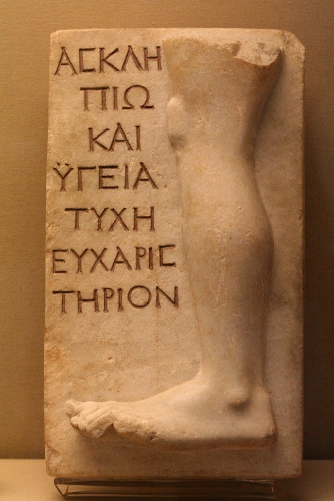

# Lesson 16: Ancient Greek Health and Medicine
{: .no_toc}

1. TOC
{:toc}

## Objectives

1. Learn about the state of health and wellness in Ancient Greece
2. Explore the origins of Western medicine from the Ancient Greek traditions

{: .note}
> **Content warning:** This reading contains discussion of outdated medical practices and attitudes towards disability, mental health, and chronic illness; medical neglect; cancer; ableism; slavery; infant mortality; and misogyny. The attitudes expressed here are those that have been expressed and documented through textual and archaeological evidence from ancient Greek societies, primarily from Athens and Sparta, and they are not reflective of current medical practices and attitudes.

## Health in Ancient Greece

It's easy to assume that ancient medicine was rudimentary at best, and carried a lot of misconceptions. While this may be true to a certain extent by modern standards, Greek physicians as we know them were remarkably good at recognizing, distinguishing, and diagnosing a variety of illnesses. They made prescriptions and provided treatments where they could, but those treatment options were largely limited by the times. Often, the only time to identify any disease at all was by physical symptoms, since they didn’t necessarily understand where disease originated on a molecular or cellular level.

This was largely due to the fact that while diseases themselves were fairly well known and understood, the transmission of disease was not. Ancient Greeks didn’t have any concept of **germs**, and they certainly wouldn’t have linked widespread transmission of infectious diseases to anything like common water sources, airborne transmission, or even the ability for animals, insects, or humans to carry diseases. Certainly there were animals and insects that were known to have poison or venom, like certain snakes and insects; and it was common knowledge that battlefield injuries could fester or rot. As far as infectious *diseases* were concerned, though, there wasn’t any concept of how those came around.

Because of that, there are many documented instances of plagues in the ancient world. A few years ago I would have said that living with the near-constant threat of plague or infectious disease would have been unthinkable, but for many of us, that reality is not as unfathomable anymore. The difference between ancient and modern plague may very well be one of scale. Because the Greek city-states were largely self-contained, walled, and were at varied times at war and at peace with one another, any breakouts that occurred were largely contained to the city-state that they first appeared in.

{: .note}
> The difference between ancient **epidemics** and the global coronavirus **pandemic** is reflected in their names. You know the roots *epi* and *pan*. The root **dem** means "people" or "state". Based on this, what do you think the difference between the words is?

That being said, most Greeks didn't exactly live relatively healthy lives, either&mdash; at least, not by modern standards. In fact, most Greeks in the ancient world would likely have been living with some amount of physical pain, if not chronic as well. The simple but harsh reality of the time was that many treatments just weren’t available, and contrary to what modern health experts say, they had to live with their pains and push through them. When medical treatment is either expensive or ineffective, it’s often necessary to just go without. This is especially the case for enslaved persons, as ancient Greece was built on slave societies. Enslaved persons were also unfortunately deprioritized from the existing healthcare services.

When it comes to Greek medicine in general, there are two main traditions that arose sometime in the fifth century BCE. The first of these follows **Hippocrates of Kos**, and this is the branch of medicine that gave rise to the Western European medical practice and is still in use today. The other is the **cult of Asclepius**, a semi-mythical and deified figure. Now, contrary to popular belief, the average person in ancient Greece would probably have had more contact with medical practices that were more religious or spiritual in nature. While Hippocrates and the Hippocratics were absolutely foundational to the Greek understanding of the body and medicine, there were still a fair amount of the Greek population that would have sought treatment and remedy from the gods, rather than from physicians. We’ll dive into why this more in a later section.

### Sickness

Most of what has been discovered through archaeological and textual evidence from the ancient world has been corroborated through the work of **paleopathologists**. And you can see from the bases there, we have PALEO, meaning “ancient”, and PATH, meaning “disease”. So a paleopathologist studies ancient diseases, or diseases in the ancient world. We do have many writings that are attributed to Hippocrates and followers of the Hippocratic tradition, but many of our sources also come from historians like Thucydides and Herodotus, who describe various plagues throughout Athenian and panhellenic history (“panhellenic” being another word for “across Greece”, since there wasn’t any unified Greece at the time).

From the records that we have, though the Greeks didn’t necessarily call them by these names, we have documentation for diseases like dysentery, malaria, scurvy, tuberculosis, pneumonia, diphtheria, chickenpox, rickets, anemia, smallpox, and typhoid fever. In fact, it’s theorized that the right-hand man and best friend of Alexander the Great, Hephaestion, actually died of typhoid.

Beyond that, we also have documented cases of **cancer** from the physician Galen, who’s writing much later, around the second century CE. Now by this time, Greece was firmly under Roman rule, so Galen’s word for what he was seeing came from Latin. The word “cancer” originally did came from the word for “crab” in Latin, due to the appearance of some swollen or darkened veins being similar to the limbs of a crab.

There were also some documented cases of **epilepsy**, most famous of which was Julius Caesar himself. In recent years, the theory has changed that Caesar actually suffered from frequent strokes, not epilepsy. In the ancient world, it’s hard to distinguish between epilepsy, non-epileptic seizures, and strokes, since all three could reasonably fit under the vague description of “the falling sickness” (think about what "epilepsy" literally translates to). Whatever the case for Caesar specifically, there are records of votive offerings and medicinal wards for children with symptoms that line up quite closely with modern understanding of epilepsy, including fainting, falling, seizures, muscle spasms, and having a dry mouth.

Outside of these documented illnesses, there were general bouts of infection and milder diseases due to general malnutrition and unspecified prevalence of plague. There was also a higher rate of infection and sickness due to battlefield injury, since field medicine was not extremely widely practiced. On top of that, urban sanitation and the water supply were probably not very clean by modern standards. The general uncleanliness of the average Greek city-state was not much help when it came to preventing transmissible diseases.

### Miasma

In the ancient Greek imagination, **miasma** (lit., "pollution") can represented almost analogously to a modern virus. There was both a physiological and religious component to miasma, since it was believed to spread if left unchecked, and it would result in human and livestock infertility, crop failure, and overall blight and barrenness. In fact, this is the underlying condition of the city of Thebes in Sophocles’ Oedipus Rex, where King Oedipus is trying to figure out what’s responsible for causing the plague in Thebes.

Miasma usually had one of two sources: childbirth and death. Childbirth was probably the most benign cause of miasma, and murder was the most severe. There were special rituals surrounding childbirth, including restrictions on who could be with the new mother during the time that she would have been considered "polluted". Afterwards, there were additional rituals to cleanse anyone that had been affected by miasma, and to further prevent it from spreading. In fact, some sources attest to families of newborn children marking their houses to prevent others from coming in and being polluted. Since the presence of a dead body was also cause for miasma, the dead were often only cared for and seen by the immediate family and then taken outside city walls to be buried.

### Mental Health

When it comes to mental health and mental illness, the Greeks didn’t have as much in the way of explanations or treatment. There are some documented cases of mental illness which have been roughly translated over the years as “madness”. Even in the original Greek, there is little distinction between the symptoms of varied mental illnesses. The Greeks used a general term, **mania**, to describe any pattern of erratic thinking or behavior. This was far from an uncommon phenomenon, as literary representations such as the figure of Ajax the Greater in the Ajax or Agave from Euripides’ Bacchai. In fact, Heracles from Lesson 14 had a famous episode of madness that caused him to kill his wife.

Now, in all three cases—Ajax, Agave, and Heracles—their madness was induced by a god. Athena was the cause of Ajax’s madness, Dionysus Agave’s, and Hera Heracles’. And this was in-line with mainstream Greek thought at the time, that any mental illnesses or afflictions were divinely influenced.

In fact, mental health anywhere near to what we might conceive of it in modernity probably began with Plato, in the Republic. Plato describes a healthy mind as a metaphor for a healthy city-state, dividing it into three parts: a logical part, a passionate part, and a desire-driven part. The word for passion here is separate from something like love or sexual desire; it’s actually the word thumos, from which we get the base THYM, meaning “feelings”. 

{: .note}
> This tripartite division may have inspired Freud’s division of the mind into the *id*, the *ego*, and the *superego*. Whatever your thoughts on Freud are, there is no denying that he is responsible for a lot of the way mental health and its treatments have developed into the modern day—for better or for worse.

However the ancient Greeks may have conceived of mental illness, the unfortunate reality is that they did not have the resources for long-term mental health treatment. Plato suggests in his *Laws* that perhaps the mentally ill should be incarcerated, but there’s no evidence historically that anything like this ever happened. We might assume that post-traumatic stress disorder, hypervigilance, and a certain level of anxiety and depression were also common among the Greeks, particularly as these were societies of warfare and high infant mortality. But like physical diseases, the diagnosis was much easier to make than treatment.

In fact, any sort of chronic illness in ancient Greece was likely neglected by physicians, whether it was mental or physical. Physicians did not necessarily disregard chronic illness, but they often did not see any point in caring for or trying to treat an incurable ill, especially if they already had limited resources to begin with. Plato in the Republic even remarks that medicine is for people who are naturally supposed to be healthy and brief bouts of injury or illness are completely temporary; medicine isn’t for the chronically ill at all, since the widely-held belief was that such a person would be of no use to the state or even to themselves.

### Disability

Despite the prevailing attitude that medicine should only be used for the "naturally healthy", it’s likely that disability affected a great number of the Greek population by adulthood. Again, there are varied literary depictions of disability, including the god Hephaestus and the archer Philoctetes, whose involvement in the war against Troy was monumental in defeating the Trojans. In Sophocles’ play *Philoctetes*, Philoctetes recounts how he was injured and disabled through snakebite to his foot. When the Greek commanders learned that Philoctetes couldn't walk or shoot as well as he used to anymore, they took their fleets and abandoned him on their way to Troy.

Unfortunately, the treatment of Philoctetes by his fellow soldiers seems to echo the prevalent attitude towards the disabled, who were seen synonymously with those who were physically or congenitally deformed. There were few resources available for the disabled, and most Greek city-states were certainly not constructed with modern notions of accessibility in mind.
 
There are almost no documented cases of family doctors or even regular check-ups for disabled persons. If one was well-off, then the primary caregivers would be enslaved persons in the same household. If not, a disabled person would either have to find some way to push through any pain or discomfort and try to work on their own, or try to find an accommodating relative with whom to live out the rest of their days.

There was a certain amount of **stigma** associated with disability and deformity in Ancient Greece as well, since physical disability was viewed as a punishment for some slight against the gods, and congenital deformity was seen as punishment for some fault or immorality of the parents. It’s for this reason that the infant mortality rate was unfortunately quite high in many parts of Greece. In fact, it was a law in Sparta that babies deemed to be physically imperfect had to be abandoned. **Infant exposure**, as it was known, seemed to have been common enough to form the basis of many hero myths&mdash; Heracles and Oedipus were both exposed babies who were found and adopted by shepherds or farmers. It’s unclear if there was a miasma aspect to disability or deformity, but nonetheless, the Greeks were not kind to the disabled.

That being said, there are a few cases that stand out as perhaps contradictory to the overarching narrative that disability and deformity were the subject of scorn or neglect in ancient Greece. The first is that Athens did have a documented welfare system for those who were shown or proven to be disabled and incapable of working. They had a minimal allowance from the state on a daily basis. It’s assumed by scholars that this was more to the effects of veteran benefits rather than an overarching statement for the disabled population of Athens. There *was* also another law in place that allowed any Athenian citizen to sue someone else with the charge of faking a disability, so it’s difficult to say how well the welfare system really worked, or how effective or helpful it was.

There’s also the case that Hephaestus himself is a disabled person. Hephaestus is the blacksmith god of fire and machinery, and he is variously depicted as having a limp or unable to walk. He is a major figure in nearly all the mythological works, creating weapons and armor for various heroes. He’s also canonically married to Aphrodite, the goddess of love and beauty. However, he does lament his own disabled state, going so far as to wish that his parents had not birthed him at all. He’s also sometimes seen as subservient to the other gods, existing only to take commissions from them. His wife also cheats on him regularly with the able-bodied and, as far as the Greeks were concerned, more handsome Ares. On one hand, the existence of a disabled god on one hand might reflect the prevalence of disability in ancient Greece; but on the other hand, his treatment by the other gods may well reflect the treatment of the disabled.

### Old Age

When considering disability and the attitudes towards people who had difficulty caring for themselves, we shouldn’t disregard attitudes towards the population of folks who actually made it to what could be considered old age.

Archaeological evidence suggests that there was actually a fair portion of the population, perhaps somewhere between fifteen and twenty percent, that would make it to their 50s and 60s. This might not be very old by modern standards, but this was a remarkable feat in the ancient world. There are some records for various figures who supposedly lived to their 80s and beyond, but since these are written by Lucian, primarily a satirist, we might take those records with a grain of salt. Nevertheless, what we can reliably glean is that there is a fair number of people who live to be “old”, and a scant few that live to be “very old”.

On average, women’s life expectancy was lower than men’s by about ten years, in part due to the dangers of pregnancy, childbirth, and abortions. Girls often became pregnant at young ages, since they were married shortly after puberty and the primary purpose of marriage was to have children. Enslaved women and women in lower classes were also subject to manual labor, much of which was physically demanding, like spinning and woolwork. On top of this, there are some records that show that girls were not as well-cared for as boys, except in Sparta. Widespread malnutrition certainly contributed to poor health and female mortality.

For the folks who did manage to climb up into old age, though, the Greeks had a concept of **geroboskia**. This was essentially the cultural norm of younger people carrying an obligation or duty to care for the elderly. This wasn’t necessarily equivalent to the elderly being warranted respect from the younger generations. This was closer to the idea that older family members were supposed to be taken care of by younger family members. There were no nursing homes in ancient Greece, and quite frankly, the Ancient Greeks might have been quite appalled by the idea of asking or hiring non-family members to care for aged parents or grandparents.

{: .note}
> That being said, it seems that the youth of Athens were not particularly keen on caring for or even respecting their elders. In Sparta, on the other hand, elders were highly esteemed, with the historian Herodotus telling us that Spartan youths would make way for elders in the street and stand whenever an older person entered the room. It seems like a common, if not comedic, complaint from the Athenian elders that they want the Athenian youths to show the same amount of respect for their elders that the Spartan youths do for theirs.

Respected or not, however, the elderly did not seem to be very high on a physician’s priority list. There is little evidence or discussion of the sicknesses or injuries that one might suffer in old age, unlike the documented cases of younger or middle-aged patients. One Hippocratic writing gives a list of various afflictions that are common in old age but gives no instruction for treatment or remedy. As we’ve seen before, if a person seemed incurable, then this person was very likely just neglected, ignored, or overlooked.
 
## Medical Practices

Now, let's shift our focus to discussing the specific practices that were commonly used in ancient Greek medicine. It's important to note, as a disclaimer, that almost everything covered in the following sections has either been debunked by modern medicine or has undergone significant advancements over the centuries. While these ancient practices were groundbreaking for their time and laid the foundation for future developments in medicine, many of them are no longer considered effective or scientifically valid today. However, many of the concepts and treatments developed by Greek physicians continue to influence modern healthcare in more indirect ways, even if the original practices have been largely superseded by more effective approaches.
 
### Hippocratic Oath

One lasting idea from antiquity is the **Hippocratic Oath**. The oath itself is well-attested and was originally created as a moral and professional code for practicing physicians, but it's undergone some variation since its first conception. The idea was that being bound to this code would ensure that physicians do their job properly and honestly, so that they prioritize a patient’s health over their own gain or profit. The original oath can be summarized as follows:
 
- Physicians should hold their teachers in high esteem and pass on their own knowledge to anyone who takes the oath. (The original Greek mentions “sons and daughters”, so medicine, at least to Hippocrates, was a gender-neutral profession.)
- Physicians help the sick with the intent to help, not to harm.
- Physicians will not administer poisons or induce abortions.
- Physicians do not practice surgery.
- Physicians do no harm.
- Physicians are bound to medical confidentiality.

The most famous phrase of the Hippocratic oath which has survived many variations and editions of the oath is “Do no harm”. The idea of medical confidentiality, that whatever is disclosed or revealed in the process of helping patients stays between a doctor and their patient, has also withstood the test of time. In modern practice, medical professionals also uphold “patient privacy” alongside confidentiality.

Other parts of this oath are not necessarily true for the modern physician. Administering poisons and inducing abortions was unfit for the ancient Greek physician, meaning that there was no medically approved right to die or a woman’s right to choose in antiquity. Now, just because the Hippocratic physicians did not provide these services does not mean that they were altogether absent from Greek society. In fact, the Hippocratic oath itself has undergone a few updates through the years as medical and ethical knowledge has expanded. These days, it’s not even required that doctors take this particular oath, as long as they swear some other oath for best ethical and medical practices.
 
### Humoralism

**Humoralism** was the idea that the body and temperament was influenced by four different fluids: blood, bile, black bile, and phlegm. This led to the categorization of four temperaments, based on which humor was predominant: sanguine (blood), choleric (yellow bile), melancholic (black bile), and phlegmatic (phlegm). Hippocrates proposed that excessive amount or lack of one was believed to cause illness or mental disturbance, as opposed to a divine explanation. As such, the medical treatments that he developed and suggested had to do with bringing these humors into balance. Bleeding and purging were used to drain someone of blood or bile. Certain herbal poultices, oils, and minerals were also believed to draw out one or more of the humors so that they would balance together.

While humoralism is largely debunked in modern medicine, the idea of balancing bodily systems is still a key concept in internal medicine. Today, instead of the four humors, we focus on the delicate equilibrium between various physiological processes, such as hormone levels, immune function, and fluid balance. The concept of **homeostasis**, the body's ability to maintain stable internal conditions despite external changes, serves as a modern parallel to humoral thinking. For example, in treating conditions like diabetes, hypertension, or thyroid disorders, physicians aim to restore balance in the body’s metabolic or endocrine systems to ensure optimal health. While the specific mechanisms and substances involved have evolved dramatically, the underlying principle remains the same: maintaining balance within the body’s complex systems is essential for health. This focus on equilibrium continues to guide many diagnostic and therapeutic practices in contemporary internal medicine, showing how ancient ideas can still resonate in modern healthcare, even if the details have changed.
 
### Internal Medicine
Part of the reason why humoralism had such a big influence in early Greek medicine was that physicians weren’t exactly able to figure out things about the human body through dissection. The Hippocratics gained traction around the 5th century BCE, but autopsies weren’t really allowed until the 3rd century BCE. Even then, it wasn’t a common practice.

As such, it’s not really surprising that understanding of internal anatomy was mediocre at best. To their credit, early physicians were able to dissect animals, so they were able to come up with some analogies as to what organs were situated where. But aside from the major organs, you’ll notice that a lot of the terms for muscles and bones are from Latin, rather than Greek. And this is because by the time dissection and autopsies were in more common practice, Latin was the language of science, not Greek. (More on this in Lesson 19!)

Either way, general ignorance of internal anatomy did not stop physicians and philosophers from making varied conjectures about women’s bodies, most of which served as a non-subtle explanation for why women were believed to be inferior to men and needed to be kept in check&mdash; an attitude that was unfortunately quite prevalent in many ancient Greek societies. One of these theories was that all people had a certain amount of heat in their bodies that was responsible for regulating physical and mental health. Women were believed to have less heat in their bodies, which was given as a possible cause of menstruation.

This lack of heat also led to the idea that the uterus and the womb wandered around a woman’s body, disrupting the other organs and leading to mental instability, whence we derive the term **hysteria** (from **hyster**, meaning "womb" or "uterus"). It was believed that hysteria could only be controlled, if not cured, through regular sexual activity. Clearly, all three of these ideas have since been disproven.

Though the ancient Greeks did not necessarily engage in internal anatomy or surgery through the modern lens, there is documentation of battlefield medicine that could be seen as proto-surgery or first aid. In the *Iliad*, the medic Machaon (depicted as a son of Asclepius) effectively performs a field surgery for Menelaus when he cuts an arrow from the other’s shoulder. That being said, although Machaon was a son of Asclepius, he was not exclusively a medic or doctor. Any medically trained person on the battlefield was necessarily a soldier first and a doctor second.
 
### Magic and Temple Medicine

Speaking of Asclepius, we cannot disregard the sphere of medicine that would have been most ubiquitous and accessible to the Greek public: temple medicine. The cult of Asclepius, as aforementioned, developed almost simultaneously alongside the Hippocratic school. Temples and sanctuaries were constructed all over Greece, as Asclepius was not seen as a deity bound to one particular city-state or site, as Athena was for Athens or Apollo was for Delphi.

Archaeological evidence has uncovered many votive offerings and surgical instruments at the temple sites, so it’s likely that the temples were a combination of religious and medical center, with priests performing both sacred rites and physical procedures. You can see the votive on the right here has a pair of eyes. Votives usually had a visual depiction of the afflicted body part, along with an inscription or invocation to the god for healing.

    

        
        <figcaption style="text-align: left; margin-top: 5px;"><i>(Left) A clay iamata depicting a leg and an invocation to the gods Asclepius, Hygeia, and Tyche for their blessing. Image credit: Atlas Obscura</i></figcaption>
    

    
 

There are some documented cases of miracle cures, which in Greek are called **iamata**. Most seekers to the temples would present their condition to a priest, who would instruct them in a sacrifice or offering. The seeker would then spend the night in the temple, where they were supposed to have visions from the god, who would either cure them or give them instructions on how to be cured. Many post-cure votives are also found, praising the god and documenting the miracle cures.

Besides temple treatments, which could be costly, there were a variety of magical wards and amulets, along with tablets. Most magical tablets in ancient Greece were malicious and called upon gods to haunt, torment, or otherwise curse another person, but there have been a few which have been found to invoke the gods for protective or healing purposes instead. Many of these tablets and trinkets would have been small, either to be kept in the household or worn for protection.

## Vocabulary List

| Root          | Language of origin    | Meaning                   | Example           |
| :---:         | :---:                 | :---                      | :---              |
| p(a)ed        | Greek                 | child                     | pedagogy          |
| ger(o)        | Greek                 | old, old age              | gerontology       |
| iatr(i)       | Greek                 | doctor                    | pediatrics        |
| cardi         | Greek                 | heart                     | cardiac           |
| carcin        | Greek                 | cancer                    | carcinoma         |
| hyster        | Greek                 | womb, uterus              | hysteria          |
| metr          | Greek                 | uterus                    | endometriosis     |
| cephal(o)     | Greek                 | head                      | cephalopod        |
| neur          | Greek                 | nerve                     | neuron            |
| pneumon       | Greek                 | lungs                     | pneumonia         |
| alg(es)       | Greek                 | pain                      | neuralgia         |
| derm(at)      | Greek                 | skin                      | dermatology       |
| nephr         | Greek                 | kidney                    | nephrology        |
| ost(eo)       | Greek                 | bone                      | osteoporosis      |
| gastr(o)      | Greek                 | belly, abdomen            | gastrointestinal  |
| enter(o)      | Greek                 | intestines                | gastroenteritis   |
| hep(a)        | Greek                 | liver                     | hepatitis         |
| ophthalm      | Greek                 | eyes                      | ophthalmologist   |
| ch(e)ir(o)    | Greek                 | hand, wrist               | chiropractor      |
| tars          | Greek                 | ankle, sole of foot       | tarsal            |
| gyn(ec)       | Greek                 | female, feminine          | gynecology        |
| andr(o)       | Greek                 | male, masculine           | androgyny         |
| dors          | Latin                 | back (body part)          | dorsal            |

## Vocabulary Practice

**Practice Set A:** Identify the roots in each of the following words, give their language of origin, and their definitions. Also give their part of speech. Then, following the guidelines in Lesson 4, arrange the definitions of the individual roots to create a literal definition.

1. carcinogen
2. parapneumonia
3. metatarsal
4. hysterectomy
5. cardiology
6. pediatrician
7. cephalopathy
8. epidermis
9. epinephrine
10. geriatric
11. chiropractics
12. dorsalgia
13. neuropathology
14. osteoplasty
15. photophthalmia

## Reflection Questions

1. What is surprising to you about ancient Greek medicine, and why?
2. Not all elements of the original Hippocratic oath are followed today. Choose one of the original tenets and explain why a modern doctor might choose not to follow it.
3. Compare and contrast Hippocratic and temple medicine in Ancient Greece. If you were an ancient Greek, which one would you go with, and why?
4. What similarities do you see between ancient Greek and modern medicine?
