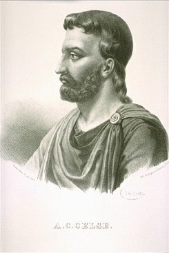
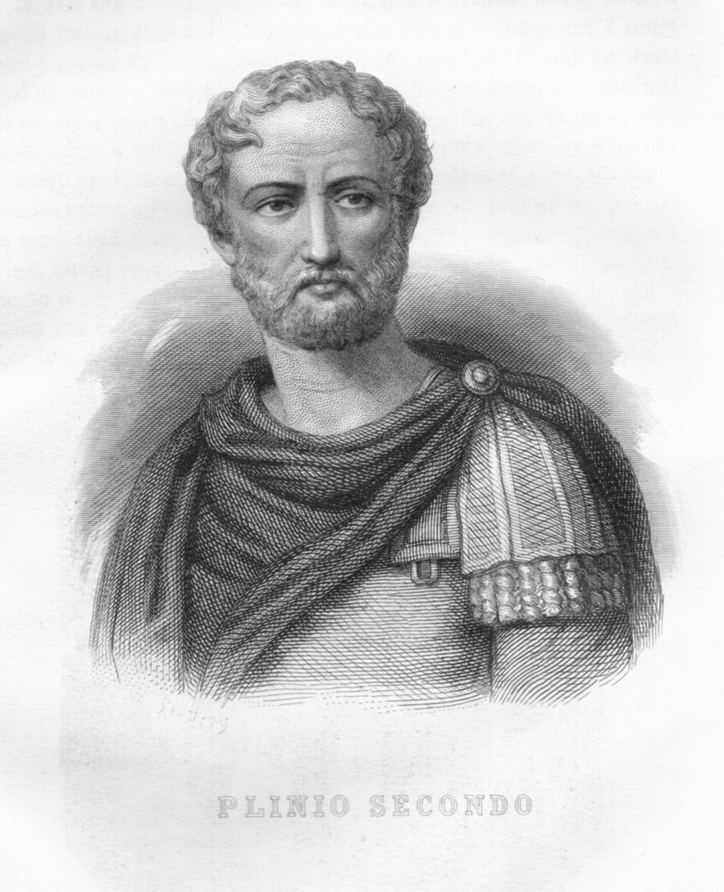
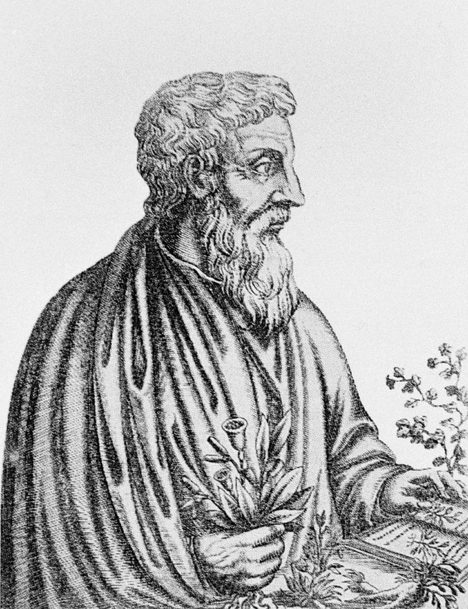
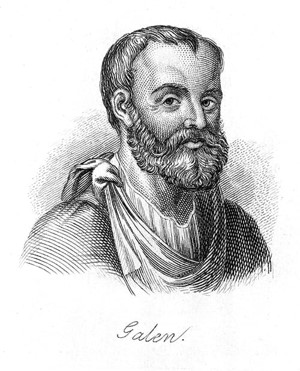

# Lesson 17: Ancient Roman Health and Medicine
{: .no_toc}

1. TOC
{:toc}

## Objectives

1. Learn about health and medicine in Ancient Rome
2. Become familiar with key figures in Roman medicine

{: .note}
> **Content warning:** This reading contains discussion of outdated medical practices and attitudes towards disability, mental health, and chronic illness; battlefield injury; ableism; slavery; infant mortality; and misogyny. The attitudes expressed here are those that have been expressed and documented through textual and archaeological evidence from ancient Rome, and they are not reflective of current medical practices and attitudes.

## Health in Ancient Rome

Generally, the state of Roman health was similar to the daily state of Greek health. There were some common diseases that we think through paleopathology might have been extant in the Roman Empire, such as gastroenteritis, hepatitis, typhoid fever, parasitic worms, and malaria. These diseases were not called as such by any Roman writers because they would mostly be describing symptoms rather than giving names to the diseases which caused them.

The understanding of diseases and transmission of diseases was also pretty similar to the Greeks, because the Romans got a lot of their medical ideas from the Greek practice, mostly through the Hippocratic methods and the sites of Asclepius. There was really no understanding that disease can be transmitted through germs or bacteria, viruses, or even carriers like animals, insects, and other people. This was particularly interesting given that the geography of Rome was quite different from that of Greece.

Most of Greece consists of mountains and highlands, and it's surrounded by the ocean on many sides. Rome, on the other hand, is situated in hills, which means that a lot of the surrounding area of Rome is very swampy, marshy, and has some lowlands. Because of Rome's more temperate climate, there would have been a lot of carriers, like mosquitoes and other insects that could have thrived in these areas. Mosquitoes, notoriously, are famed for carrying **malaria**, which comes from the Italian *mala aria*, meaning “bad air”. The idea of mala aria or “bad air” originated from Rome. They didn't call it as such, and in fact, they might have called it by a few different names. However, they did have the idea that the air around the swamps and lowlands where these insects were thriving was like a breeding ground for disease. They had some idea that the diseases would have originated in these more temperate areas, but they had no understanding that the insects themselves were transmitting.

That being said, Rome did have a relatively well developed water and sewage system in place (remember the aqueducts and sewers from Lesson 12?). There was constantly running water in Rome, which probably served some role in sort of reducing the spread of waterborne diseases such as cholera.

## Disease in Rome

As aforementioned, there was virtually no understanding of the way that diseases were transmitted. As such, in the early Roman cities, there were also very few real cures. Most of the practice of Greek medicine arrived in Rome sort of around the third and second centuries BCE. Rome had been founded in about 750 BCE, so there was a long period where disease was neither understood nor treated well.

Traditional Roman value holds that physical illness is a symptom of mental illness. In some cases, this is something that modern medicine has found to be true as well. For example, people with depression or post-traumatic stress are at higher risk for developing chronic diseases or pain disorders.

However, the way that Romans characterized mental illness is quite different from the way that we would think about it today. They believed that mental illness meant that you had bad behavior or bad thoughts; in other words, there was a moral component to physical sickness. If one was a good, upstanding citizen and a good person, then one should not be physically ill at all. On the other hand, if one was cheating, breaking the law, or treating people badly, then this would manifest in the body as well. Even immoral thoughts could lead to pain and minor illnesses.

Thus, while the Romans did recognize the concept of psychosomatic symptoms, the way that they treated mental illness was not really the same way that we would treat and recognize mental illness today. Simply put, a virtuous person in traditional Roman thinking would be very healthy all the time, while a bad or immoral person would be physically or mentally unwell. Because of this, many traditional Romans believed that all you need to do to be healthy is to live a morally correct and virtuous life. As such, many Romans also tended to prefer home remedies rather than seeking physicians.

{: .note}
> One very traditional Roman writer called Cato the Elder was a Roman statesman who was quite fond of farming and agriculture. His prescription for pretty much everything was **cabbage**. Boiled cabbage for a headache. Fried cabbage for a stomach ache. Regular cabbage consumption with every meal helps with digestion. This man thought cabbage was a miracle cure.

## Introduction of Doctors

Home remedies were commonly used in ancient Rome, but their effectiveness was often limited. While many remedies were based on long-held traditions, not all of them were scientifically sound, and their results were inconsistent. Because of this, the need for more specialized medical knowledge became apparent. Around the 200s BCE, doctors from Greece began to make their way to Rome. These Greek physicians brought with them advanced medical practices and ideas that marked a shift toward more professional and systematic approaches to healthcare. This influx of Greek medical expertise helped lay the foundation for Roman medicine, which, though still primitive by modern standards, would evolve significantly over time. The introduction of trained doctors from Greece signaled a new chapter in Roman medicine, moving away from relying solely on traditional remedies and toward a more structured understanding of health and disease.

### Rome's First Doctor

Rome's first doctor was a Greek named **Archagathos** who came to Rome around 219 BCE. The record of him coming to Rome and sort of setting up his practice is given in an account by **Pliny the Elder**, a later Roman statesman and historian. Archagathos had been practicing in the Hippocratic method, which was something that was fairly new to Rome at the time and had a lot of success.

However, Archagathos also earned a bit of a bad reputation and was called **Vulnerarius**, which roughly translates in English as “the executioner”. Archagathos's catch-all cure was *amputation*, or cutting off a person's limbs if he felt that they could not be properly treated. We would consider that maybe that's a bit silly to just immediately chop off a limb if it became diseased. Given the time period that Archagathos was working in, and given the fact that he didn't have a lot of tools, understanding of internal anatomy or surgical practices, though, amputation was really sometimes the best that people could do for diseases that were concentrated in people's limbs or for infected wounds.

### Doctors in Rome

Besides Archagathos, there were more doctors trained in both Greek and Egyptian medicine that would set up practices in Rome. As Rome gradually expanded, it would eventually consume both Greece and Egypt as provinces. Egypt is especially important because that's where Alexandria is. As was discussed in Unit 3, Alexandria itself was a center for learning, not only for mathematics and engineering, but also for trading medical knowledge as well. Many doctors that were trained in Greek medicine probably also assimilated Egyptian medical practices and vice versa. Many of the doctors who set up practice in Rome were legitimate professionals.

However, Rome did not actually have any standards or requirements to license a doctor and allow them to set up practice. This led to many people just pretending to be doctors and faking their way around just to get money from people. Some later Roman writers, particularly during the Roman Empire, complain about these sort of fake doctors who prescribe “miracle cures”, or just send patients to the healing sanctuary and take the patient's money without actually providing a cure.

In reality, medical care was usually very expensive, legitimate or not. That meant that it was usually only the wealthiest Roman citizens who were able to afford proper medical care and look after their health. Most of the Romans, what we might consider to be the middle class or the lower classes, were not very well taken care of. Similar to the Greeks, they would probably just have had to put up with whatever pain or illness they had for the day and carry on with their lives to make a living and keep making money.

While many charlatan doctors would use the existence of healing sanctuaries as an excuse to not give proper remedies or treatment to their clients, this was actually a practice that some legitimate doctors did as well. The limited understanding of medicine and health in general in those days meant that there were a lot of cases that doctors would just get confused on, even if they were legitimate and even if they had practiced with the Hippocratic method, or in any other tradition. There were still healing sanctuaries that were spread out along the Italian peninsula, in Greece, and in Egypt. All throughout the Roman Empire, there would be other healing sanctuaries, mostly for Asclepius, some for Apollo, and some for other local deities.

These healing sanctuaries worked the same way as the sanctuaries in the cult of Asclepius. A person who was ill or sick would go to a healing sanctuary. They would be guided by a priest as to what kind of sacrifices to make&mdash; usually votive offerings, but sometimes animal sacrifices. They would spend a night in the temple, where the god would appear to them and tell them what they should do in order to get better. Presumably, they would leave with some kind of cure.

### Establishment of Hospitals

Other than healing sanctuaries, though, Rome was unique in the fact that they actually did establish hospitals later on. We touched on the *valetudinaria* briefly back in Lesson 12. While doctors were largely inaccessible or not well-received by most of the Roman population, they were actually well-received and respected in the Roman military. Rome was founded as a military state, which meant that there's constant military service going on, and all men were required to serve in the military at one point or another.

{: .note}
> Even people like Cato the Elder recognized that you can be an entirely virtuous and morally correct person but still get hurt in battle through no fault of your own!

Not only were doctors better respected in the military, but they were even recognized ranks in the Roman army. The word for a doctor in Latin is **medicus** (plural **medici**). Many of the doctors in the Roman public sphere were either retired from the army, or they would make their establishment in the army and then go on and move into the public sphere.

Most public Roman hospitals were originally started as valetudinaria.These had full staff consisting first of **medici** that were just doctors, and those spent most of their time actually in the tents, attending to wounded soldiers. There were also other types of doctors in these hospitals. There were the **veteranarii**, which are veterinarians, to treat the horses and other animals that go along with the army.

The **capsarii** (singular **capsarius**) were the equivalent of field medics or proto-EMTs. These are people that wouldn't just stay inside the tents, but they would also be out on the fields alongside the soldiers and bringing them in, or doing triage and first aid, and then taking them to the valetudinaria.

Finally, there were **optio valetudinarii**, which were a combination of receptionists and nurses who would bring in the wounded soldiers and find doctors who would be able to treat them at the time. *Optio* means "chosen", and *valetudinarii* is the same word as valetudinaria. The person who is “chosen of the hospital” is the person who oversees and manages the work that's being done.

Even though these structures were originally established as military hospitals, as Rome got bigger and bigger, they became more permanent institutions. Because of this, there were actually some hospitals set up in the Roman cities to care for enslaved persons. Caring for enslaved persons was not often done, but for people who were very wealthy or had a lot of enslaved persons, or people who were kind of fond of their enslaved persons, there would be hospitals or valetudinaria that were specialized for taking care of them. That being said, the treatment of enslaved persons, as anywhere else in Rome, was rather poor. Some writers actually described the medical care there as being barbaric or akin to the treatment of animals. Even though Rome did have, theoretically, a welfare system or a hospital care system for their enslaved people, it was not often the case that they were actually well cared for inside these institutions.

### Surgery

One of the practices that was held inside the valetudinaria which also sets Roman medicine kind of apart from Greek medicine is the practice of some form of proto-surgery. This is not necessarily the surgery that we would think of today as being putting somebody under anesthesia and doing some kind of internal operation.

Most of the advancements here came from battlefield medicine, first aid, and triage. The medici of the Roman army were also studying internal organs and anatomy of other animals so that they could make conjectures about internal human anatomy. They had an understanding of where the major organs and the bones were in the body, how muscles worked, and how blood vessels worked.

When it came to war in the ancient world, there are three ways to get hurt&mdash; sword slashes, spear stabs, and arrow wounds. Most of the time, sword wounds and spear wounds which damage any part of the internal organs resulted in a person basically being left to die. There were no good ways to treat infection or help people survive major stab wounds to any internal organs or any area that caused major blood loss. Even more minor wounds to the arms or legs made it likely that a person would have their limb amputated to curb the risk of infection.

Arrows, however, were tricky, because most of the arrows that people used in the ancient world had barbs on them. A doctor couldn't just pull it out without damaging a whole lot of residual flesh. There were two ways that medici developed to perform arrow removal. The first was pushing the arrow through the body and out the other side, resulting in both an entry wound and an exit wound. Oftentimes, this method resulted in infection, and it might further lead to amputation or death.

    

        
        <figcaption style="text-align: left; margin-top: 5px;"><i>(Left) A set of arrow extraction tools, including the spoon of Diocles. Image credit: Wikipedia</i></figcaption>
    

    
 

The other major tool that they had to remove arrows was a tool called the **spoon of Diocles**, named after the Greek physician who invented them. There are other extraction tools, as pictured here. A doctor would first cut away enough flesh to clamp the spoon or the rounded part around the barb of the arrow, and then pull it out straight without pushing the arrow through the body. This was quite an advancement in terms of being able to remove arrows from people's bodies without damaging a lot of the surrounding flesh, which would lead to higher chances of survival overall.

## Notable figures

So now that we've talked about some Roman practices of medicine, now I want to turn our attention to some notable figures in Roman medical history.

### Celsus

    

        
        <figcaption style="text-align: left; margin-top: 5px;"><i>The Roman physician Celsus. Image credit: Wikipedia</i></figcaption>
    

    
<b>Celsus</b> was a Roman physician who lived between 25 BCE to about 80 CE. Though Archagathos is recognized as the first Roman doctor, Celsus is recognized as the first Roman writer of medical arts and treatises. Not much is known about his personal life, since most of the surviving record of him is about his medical practice and the things he discovered. 

    
 

His most well-known and only surviving work is a treatise called *De Medicina*, or *On Medicine*. Now, *De Medicina* is actually one chapter of what we believe to be more encyclopedic work. He would have written more other parts about things like zoology, astrology, maybe natural medicines and things like that. But the only part of the encyclopedia that survives is his treatise about medicine. This is actually really important for us because it gives us an understanding of the way that Roman doctors, the most advanced of them, understood anatomy, internal medicine, and diagnostic criteria.

In *De Medicina*, Celsus provides remarkably accurate details for diagnostic symptoms of inflammation and fever, certain skin diseases, eye infections and cancer. He identified four signs of inflammation and called them **dolor** (pain), **calor** (heat), **rubor** (redness), and **tumor** (swelling). Celsus was also quite interesting because he wrote on the psychological aspects of medicine. When we talk about the psychological aspects of medicine, I don't mean that Celsus was a psychologist or a therapist or studied human behavior and thought processes. But he did think about some parts of mental health quite a bit.

Celsus also emphasized the importance of physician and patient relationships. In particular, he believed that physicians should care for patients' mental health along with their physical health. This might have been caused by the fact that the Romans traditionally did think that mental health was quite closely linked with physical health. However, Celsus doesn't necessarily make any mentions of showing patients how to live a moral life or how to be a virtuous citizen. He really just said that doctors should basically be nice to their patients and treat them with respect. For example, if a doctor is delivering bad news to a patient, they should do so with kindness and empathize with their patient.

{: .note}
> Celsus also complained often about rich patients because he believed that the patient-physician relationship, which is built on respect, trust and kindness, should go both ways. However, the richer a patient was, the more impatient they would get. They would want cures immediately. They would try to justify giving money as a reason why the physician should be able to come up with cures that maybe they didn't have.

### Pliny the Elder

    

        
        <figcaption style="text-align: left; margin-top: 5px;"><i>The Roman statesman and natural historian Pliny the Elder, Image credit: Wikipedia</i></figcaption>
    

    
<b>Pliny the Elder</b> (c. 26-79 CE) was not actually a physician and didn't write a lot of what we might consider scientific medical treatments, but he was a writer and military commander who wrote quite extantly and was quite well known and well received at the time.

    
 

He mostly wrote some histories, but his best known work is **Naturalis Historia**, or *Natural History*. Naturalis Historia is considered by many to be the first full encyclopedia in antiquity. It covers a lot of different topics, including medicine, botany, zoology and history, which at the time, covered nearly all of the known Roman sciences.

Naturalis Historia in terms of medicine is quite famous or notorious because it has a lot of home cures in it. Pliny spends one book talking a lot about a bunch of different home cures that different plants have, that different animals have, and the ways that you can mix animal plants and other substances to create home potions and home remedies. Some of them actually make sense and some of them hold up for the modern day. One of these is a herb called **rue**. Pliny gives 84 ailments that rue can be used to cure, such as inflammation, headache, and hangovers. Herbal teas that use rue can be used to soothe the same maladies.

Some of his other home remedies, or proposals thereof, might seem a bit weird or kind of strange to us these days. Pliny did actually propose using feces and urine from many different animals as home remedies, one of them being that you can rub boar dung on foot calluses. I don't think that this is a practice that I would recommend. I certainly don't think it's very sanitary or hygienic, but Pliny the Elder seemed to believe it was. And whether he made it up or whether it was just a practice that the Romans actually did is uncertain, but it was one of the cures that he proposed.

{: .note}
> Comparatively speaking, that's actually one of the milder cures that Pliny proposes. To cure excessive daytime sleepiness, he suggests cutting calluses from donkeys, soaking them in vinegar and putting them up the nostrils. It's certainly one way to wake someone up.

### Dioscorides

    

        
        <figcaption style="text-align: left; margin-top: 5px;"><i>Greek-Roman physician Dioscorides. Image credit: Wikipedia</i></figcaption>
    

    
<b>Dioscorides</b> (c. 40-90 CE) was approximately contemporaneous with Pliny. Dioscorides was a Greek physician living in Greece while it was a province of Rome. He was also a botanist, and he was interested in how plants and minerals could be used to treat or cure diseases. His claim to fame was the work <b>De Materia Medica</b>, or <i>On Medical Materials</i>, an encyclopedia specifically about different pharmaceutical sbustances like plants, minerals, and animal parts.

    
 

Because of this, Dioscorides is considered the father of pharmacology. Now, Dioscorides didn’t have much contact with Rome itself, since he lived and practiced mostly out of Greece and Alexandria. However, he identified lots of plants, animals and minerals, which are purported to have healing properties. Some of them, some herbs, such as rue, he also identified some of them still hold up today to have these kinds of natural remedies or natural healing properties to them.

But they certainly did have some kind of effect at the time that Dioscorides was writing. De Materia Medica, more so than Pliny the Elder's Naturalis Historia, would have been a primary source on home remedies available to the Romans. It was certainly a resource that many Roman physicians knew and used. Dioscordes' writings were likely taken with perhaps a little more credibility, since unlike Pliny the Elder, he was actually a practicing physician. The cures that Dioscorides provides would therefore likely more representative of what Greek and Roman medicine was at that time.

### Galen

    

        
        <figcaption style="text-align: left; margin-top: 5px;"><i>The Roman physician Galen. Image credit: Wikipedia</i></figcaption>
    

    
<b>Galen</b> (128-216 CE) was part physician, part philosopher. 

    
 

He believed in the philosophical foundations of medicine, most being that of humoralism, which was discussed in Lesson 16. He also identifies that three most important organs are the liver, the heart, and the brain. In classical philosophy, the liver, heart, and brain are associated with different parts of reason and rationality.

Notably in Plato's *Republic*, the ideal city-state is divided among three different classes, which represent three different body parts or three different kinds of desires. Physical desires are governed by the appetite and concentrated in the liver. Passion and emotion were concentrated in the heart. Finally, rationality was concentrated in the brain.Galen reasoned that if these three organs were the seats of human thought and emotion, then these must be the most important organs. These three organs seemed to be the most vital, and this belief was sustained and reasoned to the extent that protecting these parts of the body, particularly for soldiers and gladiators, would lead to higher survival rates for both.

Galen was the doctor for a gladiator school for about five years in Rome, and he used that opportunity to study anatomy. It was said that he would actually encourage his students to look at the corpses of gladiators after matches to study their body parts, and to study how their arms and legs worked. (This might be kind of gross, but if there were any organs trailing about, he said to study those as well.)

Galen was also famous for studying anatomy because he dissected many animals. He chose to dissect a lot of apes, mostly for their resemblance to humans. Because he was traveling back and forth between Rome, Alexandria, and other places throughout the Roman empire, he would have had contact with a lot of other exotic and non-native animals, such as African apes or monkeys. At the time that Galen was writing, there were some doctors who did practice dissection on human corpses, but this was largely taboo and uncommonly practiced. Galen did his next best thing, and he dissected apes instead.

Galen wrote extensively on anatomy. He had a lot of different works that survive in fragments, because he was working in and out of Alexandria. Most of his writings would probably have been in the library during many of its subsequent burnings, and some of that knowledge might have been lost. Nevertheless, Galen was well-traveled and widely-written, which granted him lasting influence as one of Rome’s most famous doctors.

## Vocabulary List

| Root          | Language of origin    | Meaning                   | Example           |
| :---:         | :---:                 | :---                      | :---              |
| clav          | Latin                 | key, collarbone           | clavicle          |
| medic(a)      | Latin                 | doctor                    | medicine          |
| cor(d)        | Latin                 | heart                     | concord           |
| capit/cipit   | Latin                 | head                      | capital           |
| nerv          | Latin                 | nerve                     | nervous           |
| pulmon        | Latin                 | lungs                     | pulmonary         |
| dol(or)       | Latin                 | pain                      | dolorous          |
| cal(or)       | Latin                 | heat                      | calorie           |
| rub(or)       | Latin                 | red, redness              | rubella           |
| tum(or)       | Latin                 | swelling, swollen         | tumor             |
| cut           | Latin                 | skin                      | cuticle           |
| ren           | Latin                 | kidney                    | adrenaline        |
| oss           | Latin                 | bone                      | ossuary           |
| ocul          | Latin                 | eyes                      | oculus            |
| manu          | Latin                 | hand                      | manual            |
| vulner(a)     | Latin                 | wound                     | vulnerable        |
| femin(a)      | Latin                 | female, feminine          | feminist          |
| vir(i)        | Latin                 | male, masculine           | virtuous          |
| dexter/dextr  | Latin                 | right (as in direction)   | dextrous          |
| sinister/sinistr | Latin              | left (as in direction)    | sinister          |

## Vocabulary Practice

**Practice Set A:** For each of the following Latin roots, give the Greek root with the same definition.

1. cut
2. capit/cipit
3. cor(d)
4. ped
5. medic
6. pulmo(n)
7. oss
8. ren

**Practice Set B:** Identify the roots in each of the following words, give their language of origin, and their definitions. Also give their part of speech. Then, following the guidelines in Lesson 4, arrange the definitions of the individual roots to create a literal definition.

1. clavicle
2. orthopedics
3. subcutaneous
4. adrenal
5. occipital
6. postcordial
7. interocular
8. pulmonocardiac
9. virility
10. manuscript
11. ambidextrous
12. sinistrotorsion
13. erubescence
14. invulnerable
15. ossicle

## Reflection Questions

1. What surprised you about Roman medicine, and why?
2. What similarities and differences do you see between Greek and Roman medical practice?
3. What ideas from Roman medical practices do you still see today?
4. How did the establishment of Rome as a military state affect the legitimacy of the medical practice?
